# Rhiza Template Bundle Visualization

Visual diagrams illustrating the template bundle system design.

---

## Bundle Dependency Graph


**Legend:**
- 🟢 Green: Required (core)
- 🟡 Yellow: Composite bundle (has dependencies)
- 🔵 Blue: Standalone bundles
- Solid arrow: Hard requirement
- Dotted arrow: Optional recommendation

---

## Bundle File Distribution


---

## Template Resolution Flow


---

## Bundle Composition by Feature


---

## User Configuration Evolution

### Before: Manual File Listing


### After: Template Selection


---

## Example: Data Science Project Setup

```mermaid
flowchart TD
    config["User selects:<br/>templates:<br/>  - tests<br/>  - marimo<br/>  - book"]
    
    config --> expand[Expand Templates]
    
    expand --> core_auto[AUTO: core<br/>~30 files]
    expand --> tests_user[USER: tests<br/>~30 files]
    expand --> marimo_user[USER: marimo<br/>~6 files]
    expand --> book_user[USER: book<br/>~5 files]
    
    book_user -.->|requires| tests_dep[AUTO: tests<br/>already selected ✓]
    book_user -.->|recommends| marimo_dep[AUTO: marimo<br/>already selected ✓]
    
    core_auto --> total[Total: ~71 files]
    tests_user --> total
    marimo_user --> total
    book_user --> total
    
    style config fill:#e1f5e1,stroke:#4caf50,stroke-width:2px
    style total fill:#d1ecf1,stroke:#0dcaf0,stroke-width:3px
    style tests_dep fill:#fff3cd,stroke:#ffc107,stroke-width:2px
    style marimo_dep fill:#fff3cd,stroke:#ffc107,stroke-width:2px
```



---

## Bundle File Breakdown

### Docker Bundle Structure

```
docker (5 files)
│
├── Configuration
│   └── docker/Dockerfile
│   └── docker/Dockerfile.dockerignore
│
├── Make Targets
│   └── .rhiza/make.d/07-docker.mk
│       ├── docker-build
│       ├── docker-run
│       └── docker-clean
│
├── CI/CD
│   └── .github/workflows/rhiza_docker.yml
│       ├── Lint with hadolint
│       └── Build validation
│
└── Documentation
    └── docs/DOCKER.md
```

### Tests Bundle Structure

```
tests (~30 files)
│
├── Configuration
│   ├── pytest.ini
│   └── .rhiza/requirements/tests.txt
│
├── Make Targets
│   └── .rhiza/make.d/01-test.mk
│       ├── test
│       ├── coverage
│       └── benchmarks
│
├── Test Suite
│   └── tests/test_rhiza/**
│       ├── conftest.py
│       ├── test_*.py (10+ files)
│       └── benchmarks/**
│
├── GitHub Actions
│   ├── .github/workflows/rhiza_ci.yml
│   ├── .github/workflows/rhiza_benchmarks.yml
│   ├── .github/workflows/rhiza_mypy.yml
│   ├── .github/workflows/rhiza_security.yml
│   └── .github/workflows/rhiza_codeql.yml
│
└── GitLab CI
    └── .gitlab/workflows/rhiza_ci.yml
```

### Book Bundle Structure

```
book (5 files + dependencies)
│
├── Configuration
│   └── .rhiza/templates/minibook/**
│
├── Make Targets
│   └── .rhiza/make.d/02-book.mk
│       └── book (aggregates: docs + coverage + tests + notebooks)
│
├── CI/CD
│   ├── .github/workflows/rhiza_book.yml (GitHub Pages)
│   └── .gitlab/workflows/rhiza_book.yml (GitLab Pages)
│
├── Documentation
│   └── docs/BOOK.md
│
└── Dependencies (auto-included)
    ├── REQUIRED: tests (for coverage & test reports)
    └── RECOMMENDED: marimo (for notebook exports)
```

---

## Migration Path


**Example Migration:**

```yaml
# Phase 1: Old Config (before)
include: |
  docker/Dockerfile
  docker/Dockerfile.dockerignore
  .rhiza/make.d/07-docker.mk
  .github/workflows/rhiza_docker.yml
  docs/DOCKER.md
  pytest.ini
  .rhiza/make.d/01-test.mk
  tests/**
  .github/workflows/rhiza_ci.yml
  # ... many more lines ...

# Phase 2: Hybrid (during migration)
templates:
  - docker
  - tests

include: |
  scripts/custom-deploy.sh  # Custom files only

# Phase 3: New Config (after)
templates:
  - docker
  - tests
  - book

exclude: |
  tests/benchmarks/**  # Optional exclusions
```

---

## Bundle Versioning


---

## Comparison: Before vs After

| Aspect | Before (Path-based) | After (Template-based) |
|--------|---------------------|------------------------|
| **Configuration** | List 5+ files for docker | `templates: [docker]` |
| **Completeness** | User might miss files | Guaranteed complete |
| **Dependencies** | Manual (must know book needs tests) | Automatic resolution |
| **Discovery** | Read docs to find files | `uvx rhiza list-templates` |
| **Maintenance** | Update config when files added | Automatic (bundle evolves) |
| **Customization** | Full control, verbose | Templates + include/exclude |
| **Learning Curve** | Must know all file paths | Select features |

---

## Implementation Timeline


---

*This visualization document complements the technical design in `TEMPLATE_BUNDLES_DESIGN.md`*
