# Rhiza Architecture

Visual diagrams of Rhiza's architecture and component interactions.

## System Overview

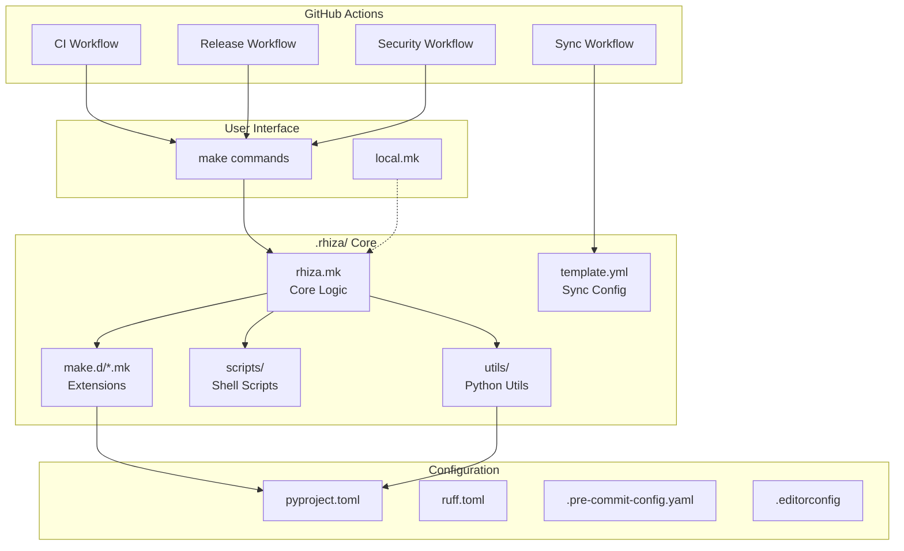

## Makefile Hierarchy

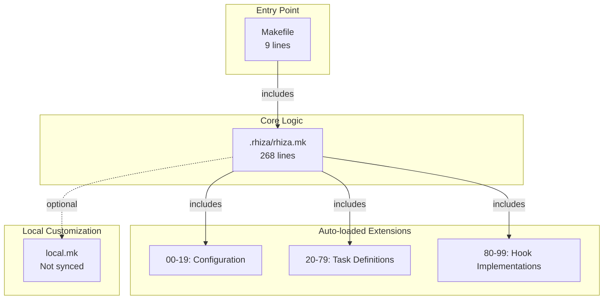

## Hook System

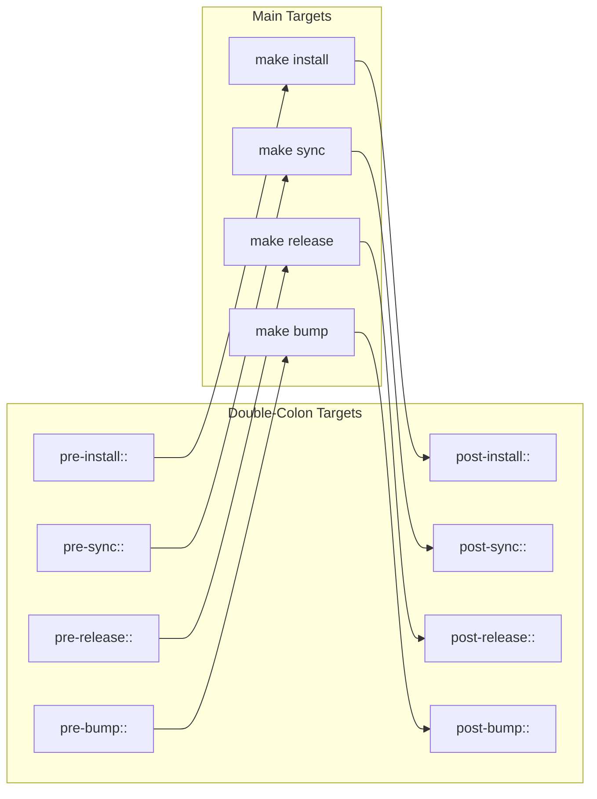

## Release Pipeline

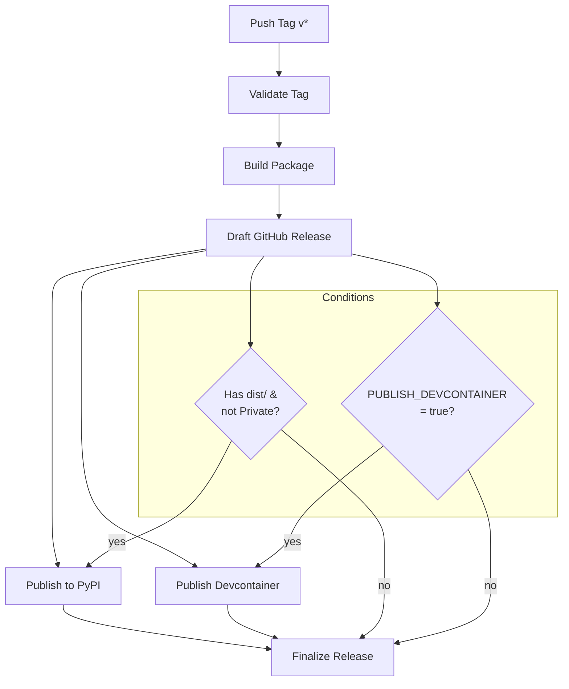

## Template Sync Flow

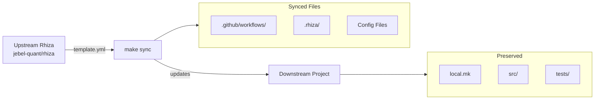

## Directory Structure

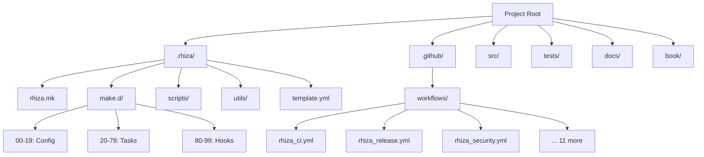

## CI/CD Workflow Triggers

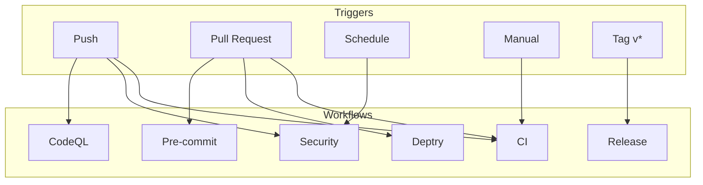

## Python Execution Model

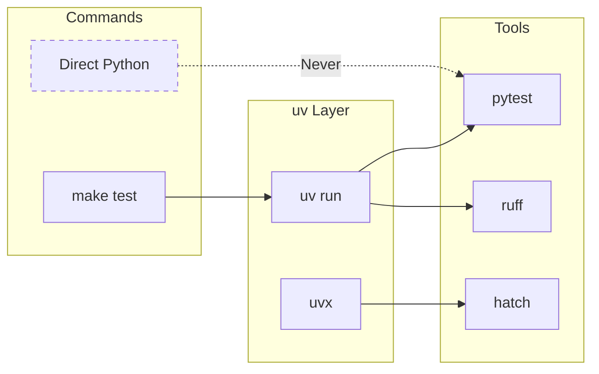

---

## Deep Dive: Component Interactions

### Makefile System

The Makefile system is modular and extensible:

**Core Components:**

1. **Entry Point (`Makefile`)** — Minimal 9-line file that includes `.rhiza/rhiza.mk`
2. **Core Logic (`.rhiza/rhiza.mk`)** — 268 lines of make targets and logic
3. **Extensions (`.rhiza/make.d/*.mk`)** — Auto-loaded modular files

**Extension Loading:**

```makefile
# From .rhiza/rhiza.mk
-include .rhiza/make.d/*.mk  # Load all extensions
-include local.mk             # Load local overrides (optional)
```

Files are loaded in alphabetical order, hence the numeric prefixes:

- `00-19*.mk` — Configuration and variables
- `20-79*.mk` — Task definitions
- `80-99*.mk` — Hook implementations

**Why This Matters:**

- **Maintainability** — Core logic separate from customizations
- **Synchronization** — Core files can be updated without losing customizations
- **Extensibility** — Add features without modifying core files

**Example Flow:**

```
make test
  ↓
Makefile (includes .rhiza/rhiza.mk)
  ↓
.rhiza/rhiza.mk:test target
  ↓
pre-test:: hooks (from .rhiza/make.d/80-*.mk)
  ↓
uv run pytest
  ↓
post-test:: hooks (from .rhiza/make.d/85-*.mk)
```

---

### Template Synchronization Mechanism

**How Sync Works:**

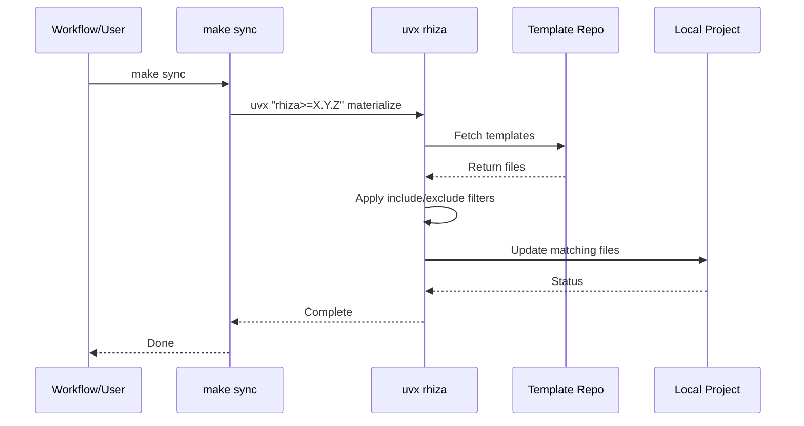

**Configuration Flow:**

1. **Read `.rhiza/template.yml`:**
   ```yaml
   repository: Jebel-Quant/rhiza
   ref: main
   include: |
     .github/workflows/*.yml
   exclude: |
     local.mk
   ```

2. **Fetch from upstream** — Clone/pull template repository

3. **Filter files:**
   - Apply `include` patterns (whitelist)
   - Apply `exclude` patterns (blacklist)
   - Result: Only matched files are considered

4. **Update local project:**
   - Copy matched files to project
   - Preserve excluded files
   - Report changes

**Key Insight:** The `exclude` list protects your customizations from being overwritten.

---

### CI/CD Pipeline Architecture

**Workflow Dependencies:**

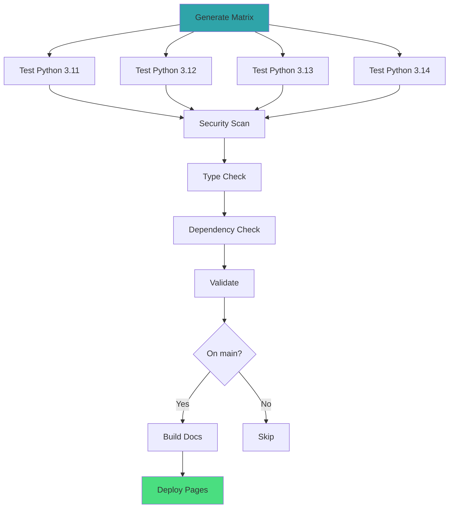

**Matrix Generation:**

The CI matrix is dynamically generated from `pyproject.toml`:

```python
# .rhiza/utils/version_matrix.py
def get_python_versions():
    classifiers = parse_pyproject()["classifiers"]
    versions = extract_versions(classifiers)
    return json.dumps(versions)
```

**Why Dynamic?**

- No manual updates needed
- Single source of truth (`pyproject.toml`)
- Prevents version drift between docs and CI

---

### Dependency Management Architecture

**uv Lock File Flow:**

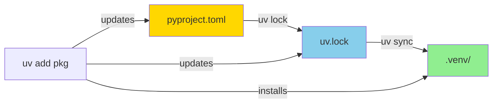

**Key Files:**

1. **`pyproject.toml`** — Human-editable dependency declarations
2. **`uv.lock`** — Exact resolved dependency versions (commit this!)
3. **`.venv/`** — Actual installed packages (never commit)

**Safety Mechanisms:**

1. **Pre-commit hook** — Runs `uv lock --check` before commit
2. **CI check** — Fails if lock file out of sync
3. **Make install** — Validates lock file before proceeding

**Workflow:**

```bash
# Option 1: uv add (recommended)
uv add requests
# ✓ Updates pyproject.toml
# ✓ Updates uv.lock
# ✓ Installs to .venv

# Option 2: Manual edit (not recommended)
vim pyproject.toml  # Add requests
uv lock             # ← You must remember this!
uv sync             # ← And this!
```

---

### Hook System Deep Dive

**How Hooks Work:**

Hooks use Make's **double-colon rules** (`::`), which allow multiple definitions of the same target:

```makefile
# .rhiza/rhiza.mk
install: pre-install actual-install post-install

pre-install::
	# Empty by default

post-install::
	# Empty by default

# .rhiza/make.d/90-hooks.mk
post-install::
	@echo "Custom post-install hook"

# local.mk
post-install::
	@echo "Another post-install hook"
```

**Execution Order:**

All `post-install::` definitions run in order:
1. Default (empty)
2. From `.rhiza/make.d/90-hooks.mk`
3. From `local.mk`

**Available Hooks:**

| Hook | When It Runs | Use Case |
|------|--------------|----------|
| `pre-install` | Before dependencies install | Check system requirements |
| `post-install` | After dependencies install | Run migrations, setup config |
| `pre-sync` | Before template sync | Backup current configs |
| `post-sync` | After template sync | Apply customizations |
| `pre-validate` | Before validation | Generate code |
| `post-validate` | After validation | Additional checks |
| `pre-bump` | Before version bump | Update changelog |
| `post-bump` | After version bump | Tag dependencies |
| `pre-release` | Before release | Build artifacts |
| `post-release` | After release | Deploy, notify team |

---

### Release Process Deep Dive

**Detailed Release Flow:**

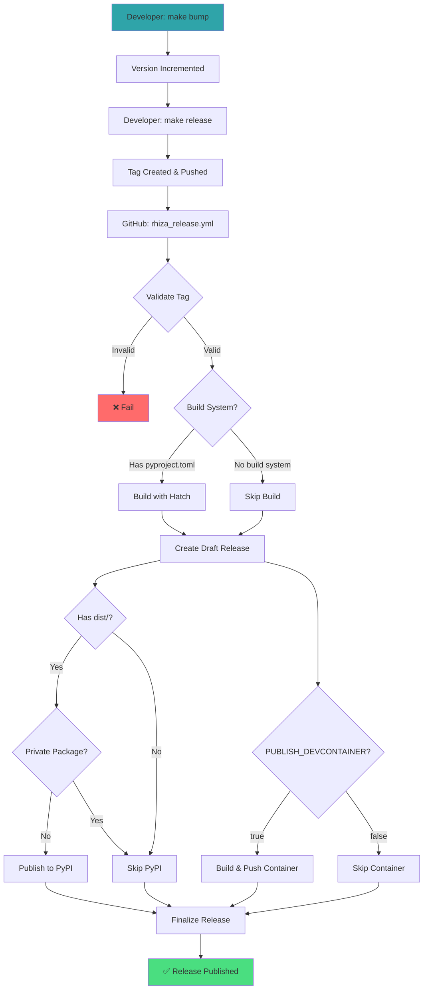

**SLSA Provenance:**

For public repositories, GitHub automatically generates **SLSA provenance attestations**:

- Cryptographic proof of build process
- Links artifacts to source code
- Verifiable build transparency

**Trusted Publishing:**

Instead of storing PyPI tokens:

1. Register your repo as a **Trusted Publisher** on PyPI
2. PyPI issues short-lived OIDC tokens to GitHub Actions
3. No long-lived credentials stored

---

### Security Scanning Architecture

**Multi-Layer Security:**

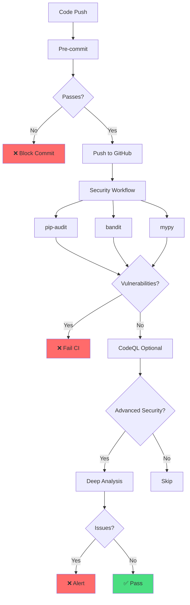

**Scanning Tools:**

1. **pip-audit** — CVE database check for dependencies
2. **bandit** — Static analysis for common Python security issues
3. **mypy** — Type safety (prevents certain bug classes)
4. **CodeQL** — Advanced semantic analysis (requires GitHub Advanced Security)

**Why Multiple Tools?**

Each catches different issue types:

- **pip-audit**: Known vulnerabilities in third-party packages
- **bandit**: Hardcoded passwords, SQL injection, etc.
- **mypy**: Type errors that could cause runtime issues
- **CodeQL**: Complex dataflow analysis (e.g., taint tracking)

---

## Design Principles

### 1. Convention Over Configuration

Rhiza provides sensible defaults so you can start immediately:

- Python 3.11+ (modern)
- pytest for testing
- ruff for linting
- uv for dependency management

**Override when needed**, but defaults work for 90% of projects.

---

### 2. Separation of Concerns

Clear boundaries between components:

| Component | Responsibility | Synced? |
|-----------|----------------|---------|
| `.rhiza/` | Core Rhiza logic | ✅ Yes |
| `local.mk` | Project-specific overrides | ❌ No |
| `src/` | Application code | ❌ No |
| `tests/` | Test suite | ❌ No |
| `.github/workflows/` | CI/CD | ✅ Yes (optional) |

---

### 3. Fail Fast

Errors detected early:

- **Pre-commit hooks** — Before code reaches CI
- **Lock file checks** — Before tests run
- **Type checking** — Before deployment
- **Security scans** — On every push

---

### 4. Reproducibility

Exact reproduction of environments:

- `uv.lock` pins all dependency versions
- Docker containers with fixed base images
- Python version matrix in CI
- Platform-specific lock files (if needed)

---

### 5. Transparency

No magic:

- All scripts in `.rhiza/scripts/` (bash, readable)
- All logic in `.rhiza/rhiza.mk` (make, readable)
- All workflows in `.github/workflows/` (YAML, readable)
- No binary blobs, no hidden behavior

---

## Performance Characteristics

### uv vs pip

**Speed Comparison:**

| Operation | pip | uv | Speedup |
|-----------|-----|----|----|
| Cold install | 45s | 1.2s | **37x** |
| Warm install | 30s | 0.8s | **37x** |
| Lock file generation | 15s | 0.5s | **30x** |

**Why uv is faster:**

- Written in Rust (compiled, not interpreted)
- Parallel dependency resolution
- Efficient caching
- Minimal network requests

---

### CI Optimization

**Parallel Execution:**

```yaml
jobs:
  test:
    strategy:
      matrix:
        python: ["3.11", "3.12", "3.13", "3.14"]
    # All versions run in parallel
```

**Caching:**

```yaml
- name: Cache uv
  uses: actions/cache@v4
  with:
    path: ~/.cache/uv
```

Typical time savings: **3-5 minutes per run**

---

## Related Documentation

- [Workflows](WORKFLOWS.md) — Day-to-day development
- [Customization](CUSTOMIZATION.md) — Extending Rhiza
- [CI/CD](ci-cd.md) — Workflow details
- [Quick Reference](QUICK_REFERENCE.md) — Command cheat sheet
- [Glossary](GLOSSARY.md) — Term definitions
