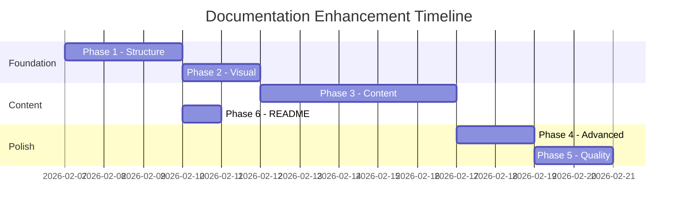

# Rhiza Documentation Enhancement Plan

A comprehensive plan for transforming the Rhiza documentation into a professional, polished resource.

**Target URL:** https://jebel-quant.github.io/rhiza/docs/index.html

---

## Current State Assessment

### Strengths

- Good content exists across 17+ markdown files
- MkDocs Material theme already configured with dark/light mode
- Mermaid diagrams present in Architecture docs
- Comprehensive Glossary and Quick Reference
- Some navigation structure in place

### Weaknesses

| Issue | Impact |
|-------|--------|
| Index page is minimal | Poor first impression — just "Browse the documentation sections using the navigation above" |
| Navigation is incomplete | Only 7 of 17+ docs are in the nav |
| Empty files | `TESTS.md` and `BENCHMARK.md` are empty |
| No visual hierarchy | Missing hero sections, icons, feature grids |
| Documentation scattered | Some in `/docs/`, some in `/.rhiza/docs/` |
| No Getting Started guide | Jumps straight into reference material |
| Missing Material features | No icons, admonitions, tabs, or annotations used |
| No API documentation integration | pdoc output not connected |

---

## Phase 1: Foundation & Structure

**Goal:** Establish proper information architecture and navigation

### 1.1 Create a Compelling Landing Page

**File:** `docs/index.md`

Create a hero section with:
- Logo and tagline
- Key value proposition (living templates vs one-shot generators)
- Feature grid with icons
- Quick start buttons/cards
- Links to GitHub, PyPI, and Codespaces

**Example structure:**

```markdown
---
hide:
  - navigation
  - toc
---

<div class="hero" markdown>
# :material-sprout: Rhiza

**Reusable Configuration Templates for Modern Python Projects**

Living templates that evolve with your project — not one-time snapshots.

[Get Started](getting-started/quickstart.md){ .md-button .md-button--primary }
[View on GitHub](https://github.com/jebel-quant/rhiza){ .md-button }
</div>

<div class="grid cards" markdown>
- :material-sync: **Living Templates** — Stay synchronized with upstream improvements
- :material-test-tube: **Testing Ready** — pytest configuration out of the box
- :material-rocket-launch: **CI/CD Workflows** — GitHub Actions & GitLab CI included
- :material-book-open-variant: **Documentation** — pdoc, minibook, and Marimo support
</div>
```

### 1.2 Reorganize Navigation

**File:** `docs/mkdocs.yml`

Restructure into logical sections:

```yaml
nav:
  - Home: index.md
  - Getting Started:
    - Quick Start: getting-started/quickstart.md
    - Installation: getting-started/installation.md
    - Your First Sync: getting-started/first-sync.md
  - User Guide:
    - Development Workflows: WORKFLOWS.md
    - Customization: CUSTOMIZATION.md
    - Releasing: RELEASING.md
    - Testing: TESTS.md
  - Reference:
    - Quick Reference: QUICK_REFERENCE.md
    - Architecture: ARCHITECTURE.md
    - Glossary: GLOSSARY.md
    - Benchmarks: BENCHMARK.md
  - Features:
    - Dev Containers: DEVCONTAINER.md
    - Docker: DOCKER.md
    - Marimo Notebooks: MARIMO.md
    - Presentations: PRESENTATION.md
    - Documentation Generation: BOOK.md
  - Operations:
    - Security: SECURITY.md
    - CI/CD Pipelines: ci-cd.md
    - Private Packages: private-packages.md
    - Token Setup: token-setup.md
  - Resources:
    - Demo: DEMO.md
    - FAQ: faq.md
    - Migration Guide: migration.md
```

### 1.3 Create Getting Started Section

**New files to create:**

| File | Purpose |
|------|---------|
| `docs/getting-started/quickstart.md` | 5-minute introduction for new users |
| `docs/getting-started/installation.md` | Prerequisites, uv setup, environment configuration |
| `docs/getting-started/first-sync.md` | Walk through template sync with a real example |

**quickstart.md outline:**

```markdown
# Quick Start

Get up and running with Rhiza in 5 minutes.

## Prerequisites
- Python 3.11+
- Git
- uv (recommended) or pip

## For New Projects

\`\`\`bash
cd /path/to/your/project
uvx rhiza init
# Edit .rhiza/template.yml
uvx rhiza materialize
\`\`\`

## For Existing Projects

\`\`\`bash
cd /path/to/existing/project
uvx rhiza init
uvx rhiza materialize
\`\`\`

## What Happens Next?

1. **CI/CD Workflows** — Automatically set up
2. **Pre-commit Hooks** — Code quality enforced
3. **Makefile** — 40+ ready-to-use targets
4. **Dev Container** — VS Code/Codespaces ready

[Continue to Installation →](installation.md)
```

### 1.4 Consolidate Scattered Documentation

Move or symlink `.rhiza/docs/*.md` content:

| Source | Target |
|--------|--------|
| `.rhiza/docs/TOKEN_SETUP.md` | `docs/token-setup.md` |
| `.rhiza/docs/PRIVATE_PACKAGES.md` | `docs/private-packages.md` |
| `.rhiza/docs/CONFIG.md` | Merge into Architecture or create `docs/config.md` |

---

## Phase 2: Visual Enhancement

**Goal:** Make documentation visually appealing and professional

### 2.1 Enable Additional MkDocs Material Features

**File:** `docs/mkdocs.yml`

```yaml
site_name: Rhiza Documentation
site_description: Reusable configuration templates for modern Python projects
site_url: https://jebel-quant.github.io/rhiza/docs/
repo_url: https://github.com/jebel-quant/rhiza
repo_name: jebel-quant/rhiza
edit_uri: edit/main/docs/

theme:
  name: material
  logo: assets/rhiza-logo.svg
  favicon: assets/rhiza-logo.svg
  palette:
    - scheme: slate
      primary: teal
      accent: cyan
      toggle:
        icon: material/brightness-4
        name: Switch to light mode
    - scheme: default
      primary: teal
      accent: cyan
      toggle:
        icon: material/brightness-7
        name: Switch to dark mode
  features:
    - navigation.instant
    - navigation.instant.prefetch
    - navigation.tracking
    - navigation.tabs
    - navigation.tabs.sticky
    - navigation.sections
    - navigation.expand
    - navigation.indexes
    - navigation.top
    - toc.follow
    - search.suggest
    - search.highlight
    - search.share
    - content.code.copy
    - content.code.annotate
    - content.tabs.link
    - content.action.edit
  icon:
    repo: fontawesome/brands/github

markdown_extensions:
  - abbr
  - admonition
  - attr_list
  - def_list
  - footnotes
  - md_in_html
  - tables
  - toc:
      permalink: true
  - pymdownx.arithmatex:
      generic: true
  - pymdownx.betterem:
      smart_enable: all
  - pymdownx.caret
  - pymdownx.details
  - pymdownx.emoji:
      emoji_index: !!python/name:material.extensions.emoji.twemoji
      emoji_generator: !!python/name:material.extensions.emoji.to_svg
  - pymdownx.highlight:
      anchor_linenums: true
      line_spans: __span
      pygments_lang_class: true
  - pymdownx.inlinehilite
  - pymdownx.keys
  - pymdownx.mark
  - pymdownx.smartsymbols
  - pymdownx.snippets
  - pymdownx.superfences:
      custom_fences:
        - name: mermaid
          class: mermaid
          format: !!python/name:pymdownx.superfences.fence_code_format
  - pymdownx.tabbed:
      alternate_style: true
  - pymdownx.tasklist:
      custom_checkbox: true
  - pymdownx.tilde

plugins:
  - search:
      separator: '[\s\-,:!=\[\]()"/]+|(?!\b)(?=[A-Z][a-z])|\.(?!\d)|&[lg]t;'
  - minify:
      minify_html: true

extra:
  social:
    - icon: fontawesome/brands/github
      link: https://github.com/jebel-quant/rhiza
  generator: false

extra_css:
  - stylesheets/extra.css
```

### 2.2 Create Custom Stylesheet

**New file:** `docs/stylesheets/extra.css`

```css
/* Hero section styling */
.hero {
  text-align: center;
  padding: 2rem 0;
}

.hero h1 {
  font-size: 3rem;
  margin-bottom: 0.5rem;
}

/* Feature grid cards */
.grid.cards > ul {
  display: grid;
  grid-template-columns: repeat(auto-fit, minmax(250px, 1fr));
  gap: 1rem;
  padding: 0;
  list-style: none;
}

.grid.cards > ul > li {
  padding: 1rem;
  border: 1px solid var(--md-default-fg-color--lightest);
  border-radius: 0.5rem;
}

/* Code block improvements */
.highlight {
  border-radius: 0.5rem;
}

/* Admonition customization */
.md-typeset .admonition {
  border-radius: 0.5rem;
}
```

### 2.3 Convert Content to Use Admonitions

Replace informal notes with proper admonitions throughout:

**Before:**
```markdown
> **Note**: This is important information.
```

**After:**
```markdown
!!! note
    This is important information.
```

**Admonition types to use:**

| Type | Use For |
|------|---------|
| `!!! note` | General information |
| `!!! tip` | Helpful suggestions |
| `!!! warning` | Potential issues |
| `!!! danger` | Critical warnings |
| `!!! example` | Code examples with context |
| `!!! info` | Background information |
| `!!! success` | Successful outcomes |

### 2.4 Add Tabbed Code Examples

Use tabs for platform-specific or alternative commands:

```markdown
=== "uv (Recommended)"
    ```bash
    uv add requests
    ```

=== "pip"
    ```bash
    pip install requests
    ```

=== "make"
    ```bash
    make install
    ```
```

---

## Phase 3: Content Completion

**Goal:** Fill gaps and ensure comprehensive coverage

### 3.1 Complete Empty Files

#### `docs/TESTS.md`

```markdown
# Testing Guide

Comprehensive guide to testing in Rhiza-based projects.

## Running Tests

### Quick Start

\`\`\`bash
make test
\`\`\`

### Running Specific Tests

\`\`\`bash
# Single file
uv run pytest tests/path/to/test.py -v

# Single test function
uv run pytest tests/path/to/test.py::test_name -v

# With output
uv run pytest -v -s

# Stop on first failure
uv run pytest -x
\`\`\`

## Test Structure

\`\`\`
tests/
├── conftest.py          # Shared fixtures
├── test_rhiza/          # Unit tests
│   └── test_*.py
├── benchmarks/          # Performance tests
│   └── test_*.py
└── integration/         # Integration tests
    └── test_*.py
\`\`\`

## Writing Tests

### Basic Test

\`\`\`python
def test_example():
    result = my_function()
    assert result == expected
\`\`\`

### Using Fixtures

\`\`\`python
import pytest

@pytest.fixture
def sample_data():
    return {"key": "value"}

def test_with_fixture(sample_data):
    assert sample_data["key"] == "value"
\`\`\`

## CI Matrix Testing

Tests run across multiple Python versions:

- Python 3.11
- Python 3.12
- Python 3.13
- Python 3.14

## Coverage

Coverage reports are generated automatically:

\`\`\`bash
# View coverage report
open _tests/html-coverage/index.html
\`\`\`
```

#### `docs/BENCHMARK.md`

```markdown
# Benchmarks

Performance benchmarking for Rhiza-based projects.

## Running Benchmarks

\`\`\`bash
make benchmark
\`\`\`

## Viewing Results

Benchmark results are stored in `_benchmarks/`:

- `benchmarks.json` — Raw data
- `benchmarks.html` — Interactive HTML report

## Writing Benchmarks

Use pytest-benchmark for performance tests:

\`\`\`python
def test_performance(benchmark):
    result = benchmark(my_function, arg1, arg2)
    assert result is not None
\`\`\`

## CI Integration

Benchmarks run automatically in CI and results are compared against baseline.
```

### 3.2 Create New Pages

| File | Content |
|------|---------|
| `docs/ci-cd.md` | Comprehensive CI/CD workflow documentation, all GitHub Actions explained |
| `docs/migration.md` | Step-by-step guide for migrating existing projects |
| `docs/faq.md` | Frequently asked questions with answers |

### 3.3 Enhance Existing Content

#### WORKFLOWS.md Enhancements

- Add Mermaid diagram showing development workflow
- Add "Common Scenarios" section
- Add troubleshooting tips

#### CUSTOMIZATION.md Enhancements

- More hook examples
- Real-world use cases
- "Recipes" section for common customizations

#### ARCHITECTURE.md Enhancements

- Add component interaction explanations
- Link diagrams to relevant docs
- Add "Deep Dive" sections

---

## Phase 4: Advanced Features

**Goal:** Leverage advanced MkDocs Material capabilities

### 4.1 Enable Social Cards

Auto-generate preview images for social sharing:

```yaml
plugins:
  - social:
      cards_layout_options:
        background_color: "#2FA4A9"
```

### 4.2 Add Announcement Banner

For important updates or version releases:

```yaml
extra:
  announcement: "🚀 Rhiza v0.7.0 released! <a href='CHANGELOG.md'>See what's new</a>"
```

### 4.3 Create Custom 404 Page

**New file:** `docs/404.md`

```markdown
# Page Not Found

The page you're looking for doesn't exist.

[Return to Home](index.md){ .md-button .md-button--primary }

## Popular Pages

- [Quick Start](getting-started/quickstart.md)
- [Quick Reference](QUICK_REFERENCE.md)
- [Customization](CUSTOMIZATION.md)
```

### 4.4 Integrate API Documentation

Option A: Link to pdoc output
```yaml
nav:
  - API Reference: api/index.html
```

Option B: Use mkdocstrings plugin
```yaml
plugins:
  - mkdocstrings:
      handlers:
        python:
          paths: [src]
```

---

## Phase 5: Polish & Quality

**Goal:** Ensure professional finish and maintainability

### 5.1 Consistency Checklist

- [ ] All pages have proper H1 heading
- [ ] Consistent heading hierarchy (no skipped levels)
- [ ] All code blocks have language tags
- [ ] All admonitions use proper syntax
- [ ] Internal links use relative paths
- [ ] No broken links
- [ ] Consistent terminology (per Glossary)

### 5.2 Metadata for All Pages

Add front matter to each page:

```yaml
---
title: Page Title
description: Brief description for SEO and social sharing
---
```

### 5.3 Accessibility Audit

- [ ] All images have alt text
- [ ] Proper heading hierarchy
- [ ] Color contrast meets WCAG standards
- [ ] Links have descriptive text
- [ ] Tables have proper headers

### 5.4 Mobile Testing

- [ ] Navigation works on mobile
- [ ] Code blocks don't overflow
- [ ] Tables are scrollable
- [ ] Images scale properly

---

## Phase 6: README Slimming

**Goal:** Make README a lightweight gateway to full docs

### Current README

~450 lines with detailed content

### Target README

~150 lines focused on:

1. **Header** — Logo, badges, one-line description
2. **Why Rhiza** — 3-4 bullet points (not paragraphs)
3. **Quick Start** — 3 commands maximum
4. **Key Features** — Brief list
5. **Documentation Link** — Prominent
6. **Contributing** — Link to CONTRIBUTING.md

### README Template

```markdown
<div align="center">

#  Rhiza

**Reusable Configuration Templates for Modern Python Projects**

Living templates that evolve with your project.


[](https://github.com/Jebel-Quant/rhiza/actions/workflows/rhiza_ci.yml)
[](https://www.python.org/)

[📚 **Documentation**](https://jebel-quant.github.io/rhiza/docs/) · 
[🚀 Quick Start](#-quick-start) · 
[💡 Features](#-features)

</div>

## 🚀 Quick Start

\`\`\`bash
cd /path/to/your/project
uvx rhiza init
uvx rhiza materialize
\`\`\`

## 💡 Features

- 🔄 **Living Templates** — Stay synchronized with upstream improvements
- 🧪 **Testing Ready** — pytest, coverage, and CI matrix included
- 🚀 **CI/CD Workflows** — GitHub Actions & GitLab CI out of the box
- 📚 **Documentation** — pdoc, minibook, and Marimo support
- 🐳 **Dev Containers** — VS Code and GitHub Codespaces ready

## 📚 Documentation

Full documentation available at **[jebel-quant.github.io/rhiza/docs](https://jebel-quant.github.io/rhiza/docs/)**

- [Getting Started](https://jebel-quant.github.io/rhiza/docs/getting-started/quickstart/)
- [User Guide](https://jebel-quant.github.io/rhiza/docs/WORKFLOWS/)
- [Reference](https://jebel-quant.github.io/rhiza/docs/QUICK_REFERENCE/)

## 🤝 Contributing

See [CONTRIBUTING.md](CONTRIBUTING.md) for guidelines.

## 📄 License

[MIT](LICENSE)
```

---

## Deliverables Summary

| Phase | Key Output | Priority | Effort |
|-------|------------|----------|--------|
| 1 | New landing page, reorganized nav, getting-started section | 🔴 High | Medium |
| 2 | Enhanced mkdocs.yml, icons, admonitions, custom CSS | 🔴 High | Medium |
| 3 | Complete TESTS.md, BENCHMARK.md, new pages | 🟡 Medium | Large |
| 4 | Search, social cards, API docs integration | 🟢 Low | Small |
| 5 | Consistency fixes, metadata, accessibility | 🟡 Medium | Small |
| 6 | Slimmed README with docs links | 🔴 High | Small |

---

## Recommended Execution Order



### Parallel Work Opportunities

- **Phase 6** can start immediately after Phase 1 landing page is complete
- **Phase 3 content** can be worked on by multiple contributors simultaneously
- **Phase 5 quality checks** can be done incrementally throughout

---

## File Checklist

### New Files to Create

- [ ] `docs/getting-started/quickstart.md`
- [ ] `docs/getting-started/installation.md`
- [ ] `docs/getting-started/first-sync.md`
- [ ] `docs/ci-cd.md`
- [ ] `docs/migration.md`
- [ ] `docs/faq.md`
- [ ] `docs/private-packages.md`
- [ ] `docs/token-setup.md`
- [ ] `docs/stylesheets/extra.css`
- [ ] `docs/404.md`

### Files to Update

- [ ] `docs/index.md` — Complete rewrite
- [ ] `docs/mkdocs.yml` — Major enhancement
- [ ] `docs/TESTS.md` — Add content
- [ ] `docs/BENCHMARK.md` — Add content
- [ ] `docs/WORKFLOWS.md` — Add diagrams, enhance
- [ ] `docs/CUSTOMIZATION.md` — Add examples
- [ ] `docs/ARCHITECTURE.md` — Add explanations
- [ ] `README.md` — Slim down

### Assets Needed

- [ ] `docs/assets/rhiza-logo.svg` — Copy from `.rhiza/assets/`
- [ ] Social card template (optional)
