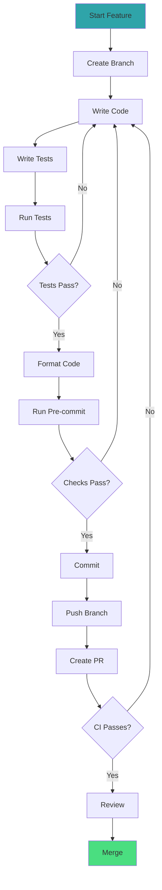
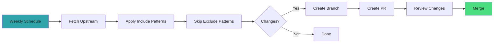
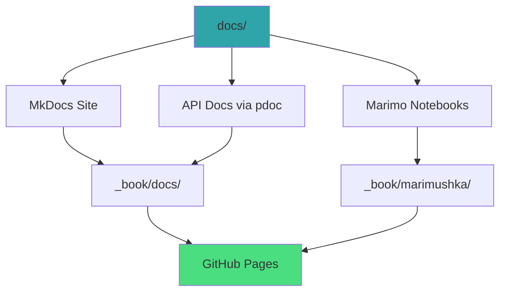

# Development Workflows

This guide covers recommended day-to-day development workflows for Rhiza projects.

---

## Development Workflow Overview



---

## Dependency Management

Rhiza uses [uv](https://docs.astral.sh/uv/) for fast, reliable Python dependency management.

### Adding Dependencies

**Recommended: Use `uv add`** — handles everything in one step:

```bash
# Add a runtime dependency
uv add requests

# Add a development dependency
uv add --dev pytest-xdist

# Add with version constraint
uv add "pandas>=2.0"
```

This command:
1. Updates `pyproject.toml`
2. Resolves and updates `uv.lock`
3. Installs the package into your active venv

### Manual Editing

If you prefer to edit `pyproject.toml` directly:

```bash
# After editing pyproject.toml, sync your environment
uv sync
```

> ⚠️ **Important:** Editing `pyproject.toml` alone does **not** update `uv.lock` or your venv. You must run `uv sync` afterward.

**Safety nets:**
- `make install` checks if `uv.lock` is in sync with `pyproject.toml` and fails with a helpful message if not
- A pre-commit hook runs `uv lock` to ensure the lock file is updated before committing
- CI will fail if you forget to update the lock file

### Removing Dependencies

```bash
uv remove requests
```

### Command Reference

| Goal | Command |
|------|---------|
| Add a runtime dependency | `uv add <package>` |
| Add a dev dependency | `uv add --dev <package>` |
| Remove a dependency | `uv remove <package>` |
| Sync after manual edits | `uv sync` |
| Update lock file only | `uv lock` |
| Upgrade a package | `uv lock --upgrade-package <package>` |
| Upgrade all packages | `uv lock --upgrade` |

## Development Cycle

### Starting Work

```bash
# Ensure your environment is up to date
make install

# Create a feature branch
git checkout -b feature/my-feature
```

### Making Changes

1. **Write code** in `src/`
2. **Write tests** in `tests/`
3. **Run tests frequently:**
   ```bash
   make test
   ```
4. **Format before committing:**
   ```bash
   make fmt
   ```

### Pre-Commit Checklist

Before committing, run these checks:

```bash
make fmt      # Format and lint
make test     # Run all tests
make deptry   # Check for dependency issues
```

Or run all pre-commit hooks at once:

```bash
make pre-commit
```

### Committing Changes

Use [Conventional Commits](https://www.conventionalcommits.org/) format:

```bash
git commit -m "feat: add new widget component"
git commit -m "fix: resolve null pointer in parser"
git commit -m "docs: update API reference"
git commit -m "chore: update dependencies"
```

Common prefixes:
- `feat:` — New feature
- `fix:` — Bug fix
- `docs:` — Documentation only
- `test:` — Adding/updating tests
- `chore:` — Maintenance tasks
- `refactor:` — Code refactoring

### Skipping CI

For documentation-only or trivial changes:

```bash
git commit -m "docs: fix typo [skip ci]"
```

## Running Python Code

Always use `uv run` to ensure the correct environment:

```bash
# Run a script
uv run python scripts/my_script.py

# Run a module
uv run python -m mymodule

# Run tests directly
uv run pytest tests/test_specific.py -v

# Interactive Python
uv run python
```

## Testing Workflows

### Run All Tests

```bash
make test
```

### Run Specific Tests

```bash
# Single file
uv run pytest tests/test_rhiza/test_makefile.py -v

# Single test function
uv run pytest tests/test_rhiza/test_makefile.py::test_specific_function -v

# Tests matching a pattern
uv run pytest -k "test_pattern" -v

# With print output
uv run pytest -v -s
```

### Run with Coverage

```bash
make test  # Coverage is included by default
```

## Releasing

See [RELEASING.md](RELEASING.md) for the complete release workflow.

Quick reference:

```bash
# Bump version (interactive)
make bump

# Bump specific version
make bump BUMP=patch  # 1.0.0 → 1.0.1
make bump BUMP=minor  # 1.0.0 → 1.1.0
make bump BUMP=major  # 1.0.0 → 2.0.0

# Create and push release tag
make release
```

## Template Synchronization

Keep your project in sync with upstream Rhiza templates:

```bash
make sync
```

This updates shared configurations while preserving your customizations in `local.mk`.

### Sync Workflow



---

## Common Scenarios

### Scenario 1: Bug Fix

```bash
# 1. Create fix branch
git checkout -b fix/issue-123

# 2. Write fix and test
# ... make changes ...
uv run pytest tests/test_fix.py -v

# 3. Verify all tests pass
make test

# 4. Format and commit
make fmt
git commit -m "fix: resolve issue #123"

# 5. Push and create PR
git push origin fix/issue-123
```

---

### Scenario 2: Adding a Feature

```bash
# 1. Create feature branch
git checkout -b feature/new-widget

# 2. Add dependencies if needed
uv add new-library

# 3. Write code and tests
# ... implement feature ...

# 4. Run tests continuously
make test-watch  # If available, or use pytest-watch

# 5. Ensure coverage
make test
# Check coverage in _tests/html-coverage/

# 6. Format and commit
make fmt
git commit -m "feat: add widget component"

# 7. Push and create PR
git push origin feature/new-widget
```

---

### Scenario 3: Dependency Update

```bash
# 1. Update specific package
uv lock --upgrade-package requests
make install

# 2. Run tests to verify
make test

# 3. Commit lock file
git commit -am "chore: upgrade requests to latest"
```

---

### Scenario 4: Security Update

```bash
# 1. Check for vulnerabilities
make security

# 2. Upgrade vulnerable package
uv lock --upgrade-package vulnerable-lib

# 3. Verify fix
make security

# 4. Run full test suite
make test

# 5. Commit and release
git commit -am "fix: security update for vulnerable-lib"
make bump BUMP=patch
make release
```

---

## Documentation Workflow

### Building Documentation

```bash
# Build all documentation
make book

# View locally
open _book/index.html

# Or serve with live reload
make book-serve  # If configured
```

### Documentation Structure



---

## Performance Optimization

### Profiling

```bash
# Profile a script
uv run python -m cProfile scripts/slow_script.py

# With line-level profiling
uv run kernprof -l scripts/slow_script.py
uv run python -m line_profiler scripts/slow_script.py.lprof
```

### Benchmarking

```bash
# Run benchmarks
make benchmark

# View results
open _benchmarks/benchmarks.html

# Compare against baseline
make benchmark BENCHMARK_COMPARE=baseline.json
```

## Troubleshooting

### Environment Out of Sync

If your environment seems broken or out of date:

```bash
# Full reinstall
rm -rf .venv
make install
```

### Lock File Conflicts

If `uv.lock` has merge conflicts:

```bash
# Accept current pyproject.toml as source of truth
git checkout --theirs uv.lock  # or --ours depending on your situation
uv lock
```

### Dependency Check Failures

If `make deptry` reports issues:

```bash
# Missing dependencies — add them
uv add <missing-package>

# Unused dependencies — remove them
uv remove <unused-package>
```

### Pre-commit Hook Failures

```bash
# Update all hooks to latest
uv run pre-commit autoupdate

# Run all hooks manually
uv run pre-commit run --all-files

# Skip hooks temporarily (emergency only)
git commit --no-verify -m "..."
```

### CI Failures After Successful Local Tests

**Common causes:**

1. **Python version mismatch** — CI tests multiple versions
   ```bash
   # Test locally with specific version
   uv run --python 3.11 pytest
   uv run --python 3.12 pytest
   ```

2. **Platform differences** — Linux vs macOS/Windows
   ```bash
   # Run in Docker to match CI environment
   docker run -v $(pwd):/app python:3.11 bash -c "cd /app && make test"
   ```

3. **Missing files in git** — Untracked files not in CI
   ```bash
   git status  # Check for untracked files
   git add <missing-files>
   ```

---

## Best Practices

### Code Organization

```
src/
├── mypackage/
│   ├── __init__.py
│   ├── core/           # Core functionality
│   ├── utils/          # Utility functions
│   ├── models/         # Data models
│   └── api/            # Public API
└── scripts/            # Standalone scripts
```

### Test Organization

```
tests/
├── conftest.py         # Shared fixtures
├── test_core/          # Unit tests
│   └── test_*.py
├── integration/        # Integration tests
│   └── test_*.py
└── benchmarks/         # Performance tests
    └── test_*.py
```

### Commit Messages

Follow [Conventional Commits](https://www.conventionalcommits.org/):

```bash
# Good commit messages
feat(auth): add JWT authentication
fix(api): handle null responses correctly
docs(readme): add installation instructions
test(core): add tests for edge cases
chore(deps): upgrade dependencies

# Bad commit messages (avoid)
"updated files"
"fix bug"
"wip"
```

### Branch Naming

```bash
# Feature branches
feature/add-authentication
feature/user-dashboard

# Bug fix branches
fix/issue-123
fix/null-pointer-exception

# Chore branches
chore/update-dependencies
chore/refactor-tests

# Documentation branches
docs/update-readme
docs/api-reference
```

---

## Related Documentation

- [Quick Start](getting-started/quickstart.md) — Get up and running
- [Testing](TESTS.md) — Testing guide
- [Releasing](RELEASING.md) — Release process
- [CI/CD](ci-cd.md) — Workflow automation
- [Customization](CUSTOMIZATION.md) — Advanced customization

---

## Quick Reference

### Daily Commands

| Task | Command |
|------|---------|
| Install/update environment | `make install` |
| Run tests | `make test` |
| Format code | `make fmt` |
| Check types | `make typecheck` |
| Security scan | `make security` |
| Run benchmarks | `make benchmark` |
| Build documentation | `make book` |
| Sync templates | `make sync` |

### Git Workflow

| Task | Command |
|------|---------|
| Create branch | `git checkout -b feature/name` |
| Stage changes | `git add .` |
| Commit | `git commit -m "type: message"` |
| Push | `git push origin branch-name` |
| Update branch | `git pull origin main` |
| Squash commits | `git rebase -i HEAD~N` |

### Dependency Management

| Task | Command |
|------|---------|
| Add dependency | `uv add package` |
| Add dev dependency | `uv add --dev package` |
| Remove dependency | `uv remove package` |
| Update all | `uv lock --upgrade` |
| Update one | `uv lock --upgrade-package pkg` |
| Sync environment | `uv sync` |
