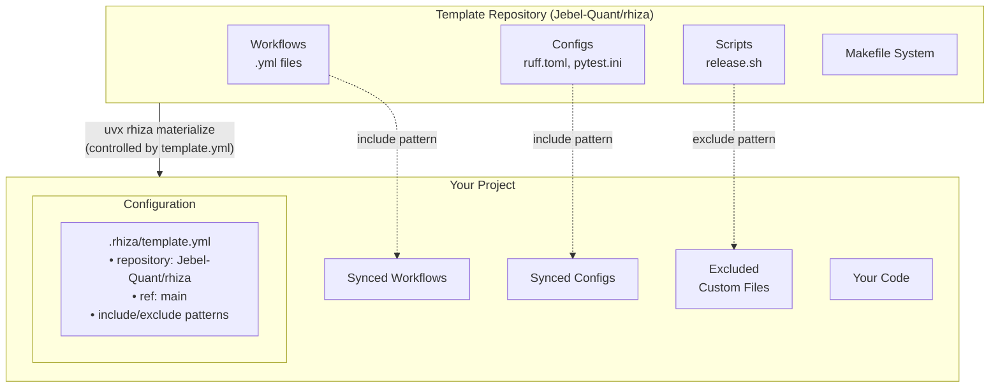
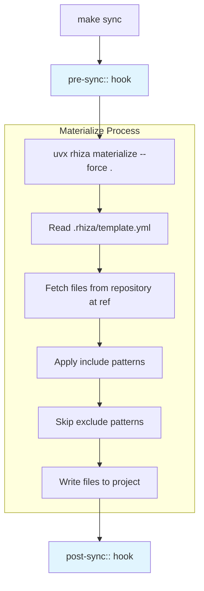
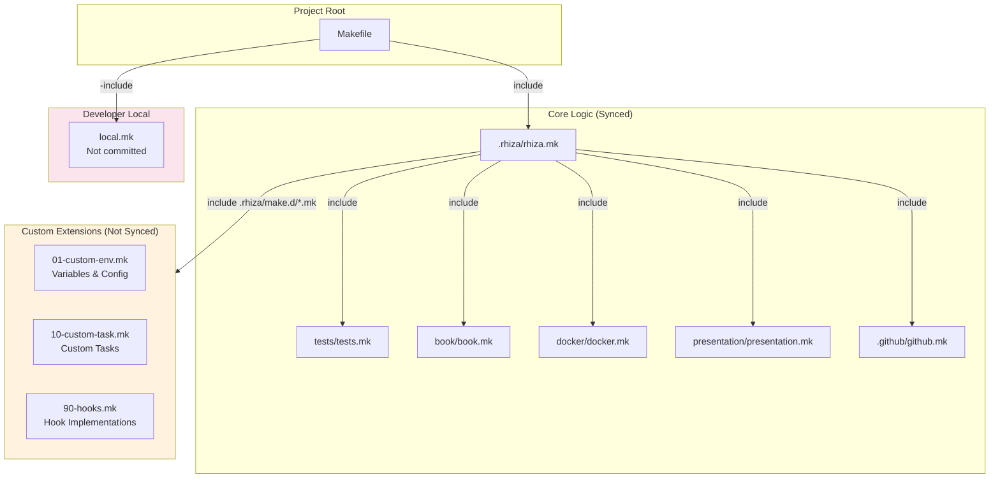
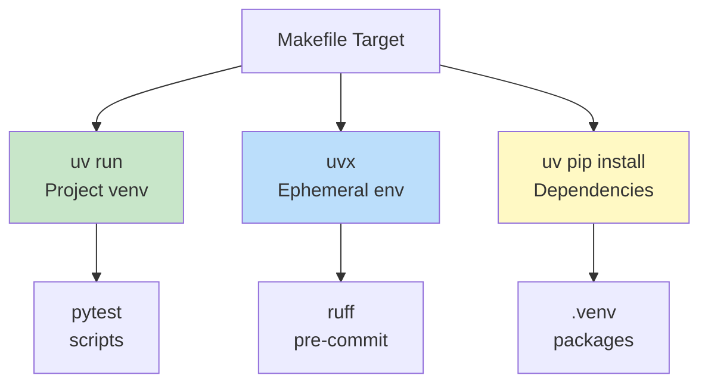
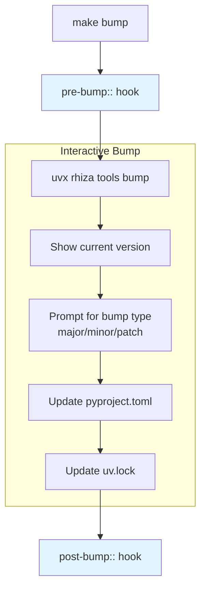
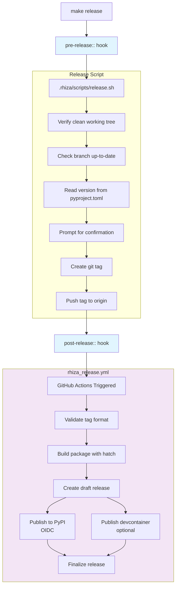

# Rhiza Architecture

This document describes the architecture of Rhiza's "living templates" system, including the template synchronization mechanism, Makefile hierarchy, and extension points.

---

## Overview

Rhiza implements a **living templates** pattern that differs from traditional template generators (cookiecutter, copier). Instead of generating a one-time snapshot, Rhiza enables continuous synchronization between your project and an upstream template repository.



---

## Template Synchronization

### Configuration File: template.yml

Projects using Rhiza define their sync configuration in `.rhiza/template.yml`:

```yaml
# .rhiza/template.yml
repository: Jebel-Quant/rhiza    # Upstream template source
ref: main                         # Branch or tag to sync from

include: |                        # Files to pull from template
  .github/workflows/*.yml
  .pre-commit-config.yaml
  ruff.toml
  pytest.ini
  Makefile

exclude: |                        # Paths to skip (protect customizations)
  .rhiza/scripts/customisations/*
  .rhiza/make.d/50-*.mk
```

### Sync Commands

| Command | Description |
|---------|-------------|
| `make sync` | Pull updates from template repository |
| `make validate` | Check if project matches template (without modifying) |
| `uvx rhiza materialize` | Direct CLI for sync operation |
| `uvx rhiza validate` | Direct CLI for validation |

### Sync Process Flow



### Automated Sync Workflow

The `rhiza_sync.yml` workflow automates synchronization:

- **Schedule**: Weekly (Mondays at 00:00 UTC)
- **Manual trigger**: Via workflow_dispatch
- **Output**: Creates a pull request with template updates
- **Requirement**: `PAT_TOKEN` secret with `workflow` scope (for modifying workflow files)

---

## Makefile Architecture

### Hierarchy

Rhiza uses a modular Makefile system with clear separation of concerns:



### File Responsibilities

| File | Purpose | Synced? |
|------|---------|---------|
| `Makefile` | Entry point, minimal (~8 lines) | Yes |
| `.rhiza/rhiza.mk` | Core targets (install, sync, release) | Yes |
| `tests/tests.mk` | Test targets | Yes |
| `book/book.mk` | Documentation targets | Yes |
| `.rhiza/make.d/*.mk` | Project-specific extensions | No |
| `local.mk` | Developer-local shortcuts | No (gitignored) |

### Hook System

Rhiza provides double-colon hook targets for customization:

```makefile
# Available hooks (defined in rhiza.mk)
pre-install::   post-install::
pre-sync::      post-sync::
pre-validate::  post-validate::
pre-release::   post-release::
pre-bump::      post-bump::
```

**Usage in .rhiza/make.d/90-hooks.mk:**

```makefile
post-install::
	@echo "Running custom post-install steps..."
	@./scripts/setup-local-config.sh

pre-release::
	@echo "Validating release requirements..."
	@make test
```

### Extension Point Conventions

Files in `.rhiza/make.d/` are loaded alphabetically. Use numeric prefixes:

| Range | Purpose | Example |
|-------|---------|---------|
| 00-19 | Configuration & Variables | `01-custom-env.mk` |
| 20-79 | Custom Tasks & Rules | `50-ml-training.mk` |
| 80-99 | Hooks & Lifecycle Logic | `90-hooks.mk` |

---

## Tool Execution Model

### uv-First Approach

All Python execution flows through `uv`:



| Command | Usage |
|---------|-------|
| `uv run` | Execute in project virtual environment |
| `uvx` | Execute in ephemeral environment (external tools) |
| `uv sync` | Install dependencies from lock file |
| `uv pip install` | Install additional packages |

### Environment Variables

```makefile
# Core variables (from rhiza.mk)
INSTALL_DIR ?= ./bin           # Where uv is installed if not in PATH
UV_BIN ?= $(command -v uv)     # Path to uv binary
UVX_BIN ?= $(command -v uvx)   # Path to uvx binary
VENV ?= .venv                  # Virtual environment path
PYTHON_VERSION ?= 3.12         # From .python-version file

# Environment settings
UV_NO_MODIFY_PATH := 1         # Don't modify shell PATH
UV_VENV_CLEAR := 1             # Clear venv before creation
```

---

## Directory Structure

```
project-root/
├── .rhiza/
│   ├── template.yml        # Sync configuration (your project)
│   ├── rhiza.mk            # Core Makefile logic
│   ├── .env                # Environment variables
│   ├── .cfg.toml           # Additional configuration
│   ├── docs/               # Rhiza documentation
│   │   ├── CONFIG.md
│   │   └── TOKEN_SETUP.md
│   ├── make.d/             # Custom Makefile extensions
│   │   ├── 01-custom-env.mk
│   │   ├── 10-custom-task.mk
│   │   └── README.md
│   ├── requirements/       # Additional pip requirements
│   │   ├── tools.txt
│   │   ├── tests.txt
│   │   └── docs.txt
│   ├── scripts/            # Automation scripts
│   │   └── release.sh
│   └── utils/              # Python utilities
│       └── version_matrix.py
├── .github/
│   └── workflows/          # CI/CD workflows (synced)
├── Makefile                # Entry point
├── pyproject.toml          # Project configuration
├── ruff.toml               # Linting configuration (synced)
├── pytest.ini              # Test configuration (synced)
└── .pre-commit-config.yaml # Pre-commit hooks (synced)
```

---

## Release Pipeline

### Version Management

Single source of truth: `pyproject.toml`



### Release Process



---

## Customization Strategies

### 1. Exclude from Sync

Add paths to `template.yml` exclude section:

```yaml
exclude: |
  .rhiza/make.d/*           # All custom make extensions
  .github/workflows/custom_*.yml  # Custom workflows
```

### 2. Use Hooks

Implement pre/post hooks in `.rhiza/make.d/`:

```makefile
# .rhiza/make.d/90-hooks.mk
post-install::
	@pip install -e ./internal-package

pre-release::
	@./scripts/run-integration-tests.sh
```

### 3. Local Extensions

Use `local.mk` for developer-specific shortcuts (not committed):

```makefile
# local.mk
dev-deploy:
	@./scripts/deploy-to-sandbox.sh
```

### 4. Fork the Template

For organization-wide customization:

1. Fork Jebel-Quant/rhiza to your organization
2. Customize workflows, configs, scripts
3. Point your projects to your fork:

```yaml
# .rhiza/template.yml
repository: your-org/rhiza-template
ref: main
```

---

## Security Considerations

1. **Minimal Permissions**: Workflows default to `contents: read`
2. **OIDC Publishing**: PyPI uses trusted publishing, no stored tokens
3. **PAT for Workflows**: Sync requires `PAT_TOKEN` when modifying workflow files
4. **Lock Files**: `uv.lock` ensures reproducible, auditable builds
5. **CodeQL Scanning**: Automated security analysis for Python and Actions
