# CI/CD Pipelines

Comprehensive guide to all GitHub Actions workflows included with Rhiza.

---

## Overview

Rhiza includes 14 pre-configured GitHub Actions workflows covering:

- :material-test-tube: **Testing** — CI matrix, type checking, benchmarks
- :material-shield-check: **Security** — Vulnerability scanning, code analysis
- :material-package-variant: **Publishing** — Releases to PyPI and GitHub
- :material-sync: **Automation** — Template sync, dependency updates
- :material-book-open-variant: **Documentation** — Automatic builds and deployment

All workflows are located in `.github/workflows/` and follow the naming convention `rhiza_*.yml`.

---

## Core Workflows

### CI Matrix Testing

**File:** `.github/workflows/rhiza_ci.yml`

**Purpose:** Run tests across multiple Python versions to ensure compatibility.

**Triggers:**
```yaml
on:
  push:
    branches: [ main, master ]
  pull_request:
    branches: [ main, master ]
```

**Key Features:**

- Dynamic Python version matrix (3.11, 3.12, 3.13, 3.14)
- Generated from `pyproject.toml` via `.rhiza/utils/version_matrix.py`
- Parallel execution across all versions
- Private package support via `GH_PAT` secret

**Matrix Generation:**

The workflow generates the Python version list dynamically:

```bash
make version-matrix
# Output: ["3.11", "3.12", "3.13", "3.14"]
```

This ensures your project only tests against versions declared in `pyproject.toml`.

**Example Output:**

```
✓ Python 3.11 — Tests passed
✓ Python 3.12 — Tests passed  
✓ Python 3.13 — Tests passed
✓ Python 3.14 — Tests passed
```

---

### Security Scanning

**File:** `.github/workflows/rhiza_security.yml`

**Purpose:** Scan for vulnerabilities and security issues.

**Triggers:**
```yaml
on:
  push:
    branches: [ main, master ]
  pull_request:
    branches: [ main, master ]
```

**Scans Performed:**

1. **pip-audit** — Check dependencies for known vulnerabilities
2. **bandit** — Static analysis for Python security issues
3. **mypy** — Type checking to catch potential bugs

**Running Locally:**

```bash
make security   # Run pip-audit and bandit
make typecheck  # Run mypy
```

---

### Release Automation

**File:** `.github/workflows/rhiza_release.yml`

**Purpose:** Automate package releases to PyPI and GitHub.

**Triggers:**
```yaml
on:
  push:
    tags:
      - 'v*.*.*'  # Example: v1.2.3
```

**Release Pipeline Phases:**

```mermaid
flowchart LR
    A[🏷️ Tag Pushed] --> B[🔍 Validate Tag]
    B --> C[🏗️ Build Package]
    C --> D[📝 Draft Release]
    D --> E[🚀 Publish to PyPI]
    E --> F[🐳 Publish Devcontainer]
    F --> G[✅ Finalize Release]
    
    style A fill:#2fa4a9
    style G fill:#4ade80
```



**Key Features:**

- **SLSA Provenance** — Cryptographic attestations for build artifacts
- **Trusted Publishing** — OIDC authentication (no PyPI tokens needed)
- **Conditional Publishing** — Skips PyPI if `Private :: Do Not Upload` in `pyproject.toml`
- **Devcontainer Publishing** — Optional container image publishing
- **Automatic Release Notes** — Links to PyPI, artifacts, and containers

**Triggering a Release:**

```bash
# Bump version
make bump BUMP=patch  # 1.0.0 → 1.0.1

# Create and push tag
make release

# Or manually:
git tag v1.2.3
git push origin v1.2.3
```

**Configuration:**

| Variable | Purpose | Default |
|----------|---------|---------|
| `PUBLISH_DEVCONTAINER` | Enable devcontainer publishing | `false` |
| `DEVCONTAINER_REGISTRY` | Container registry | `ghcr.io` |
| `PYPI_REPOSITORY_URL` | Custom PyPI feed URL | PyPI.org |

---

### Template Synchronization

**File:** `.github/workflows/rhiza_sync.yml`

**Purpose:** Keep your project synchronized with upstream Rhiza templates.

**Triggers:**
```yaml
on:
  schedule:
    - cron: '0 0 * * 1'  # Weekly on Monday
  workflow_dispatch:     # Manual trigger
```

**Workflow:**

```mermaid
flowchart TD
    A[🔔 Scheduled/Manual Trigger] --> B[📥 Fetch Upstream]
    B --> C[🔄 Materialize Templates]
    C --> D{Changes?}
    D -->|Yes| E[🌿 Create Branch]
    D -->|No| F[✅ Skip]
    E --> G[📝 Create PR]
    G --> H[👀 Review Changes]
    H --> I[✅ Merge PR]
    
    style A fill:#2fa4a9
    style I fill:#4ade80
```



**Key Features:**

- Automatic weekly sync (configurable schedule)
- Creates pull request with template updates
- Preserves your customizations via `.rhiza/template.yml` exclude patterns
- Requires `PAT_TOKEN` secret if workflow files are modified

**Manual Trigger:**

Go to **Actions** → **Sync** → **Run workflow**

**Configuration:**

Create `.rhiza/template.yml`:

```yaml
repository: Jebel-Quant/rhiza
ref: main

include: |
  .github/workflows/*.yml
  .pre-commit-config.yaml
  ruff.toml
  pytest.ini

exclude: |
  .rhiza/make.d/90-custom.mk
  local.mk
```

!!! warning "PAT_TOKEN Required for Workflow Updates"
    When syncing updates to `.github/workflows/`, you must configure a Personal Access Token with `workflow` scope. See [token-setup.md](token-setup.md) for instructions.

---

## Code Quality Workflows

### Pre-commit Checks

**File:** `.github/workflows/rhiza_pre-commit.yml`

**Purpose:** Enforce code quality standards.

**Runs:**

- `ruff format --check` — Verify formatting
- `ruff check` — Linting
- `uv lock --check` — Verify lock file is up to date

**Locally:**

```bash
make fmt  # Format and lint code
```

---

### Type Checking

**File:** `.github/workflows/rhiza_mypy.yml`

**Purpose:** Static type checking with mypy.

**Configuration:**

Type checking is configured in `pyproject.toml`:

```toml
[tool.mypy]
strict = true
warn_return_any = true
warn_unused_configs = true
```

**Locally:**

```bash
make typecheck
```

---

### Dependency Validation

**File:** `.github/workflows/rhiza_deptry.yml`

**Purpose:** Detect missing, unused, or transitive dependencies.

**Checks:**

- Missing dependencies (imported but not declared)
- Unused dependencies (declared but not imported)
- Transitive dependencies (used but only available transitively)

**Locally:**

```bash
make deptry
```

---

### CodeQL Analysis

**File:** `.github/workflows/rhiza_codeql.yml`

**Purpose:** Advanced security vulnerability scanning.

!!! note "GitHub Advanced Security Required"
    - ✅ **Free** for public repositories
    - ⚠️ **Requires GitHub Enterprise** for private repositories

**Automatic Behavior:**

- Runs on public repos automatically
- Skips on private repos (unless you have Advanced Security)

**Override:**

Set repository variable `CODEQL_ENABLED` to:
- `true` — Force enable (if you have Advanced Security)
- `false` — Disable entirely

---

### Validation Workflow

**File:** `.github/workflows/rhiza_validate.yml`

**Purpose:** Validate repository structure and configuration.

**Checks:**

- Makefile syntax
- pyproject.toml validity
- GitHub Actions workflow syntax
- Template configuration

**Locally:**

```bash
make validate
```

---

## Documentation Workflows

### Documentation Build

**File:** `.github/workflows/rhiza_book.yml`

**Purpose:** Build and deploy documentation to GitHub Pages.

**Triggers:**
```yaml
on:
  push:
    branches: [ main, master ]
```

**Builds:**

- **MkDocs** — Main documentation site
- **pdoc** — API reference (auto-generated from docstrings)
- **Marimo** — Interactive notebooks
- **Test Coverage** — HTML coverage reports

**Deployment:**

Documentation is deployed to `https://{owner}.github.io/{repo}/docs/`

**Configuration:**

Control publishing with repository variable:

| Variable | Effect |
|----------|--------|
| `PUBLISH_COMPANION_BOOK=true` | Deploy to GitHub Pages |
| `PUBLISH_COMPANION_BOOK=false` | Build only (no deploy) |

**Locally:**

```bash
make book  # Build all documentation
```

---

### Marimo Validation

**File:** `.github/workflows/rhiza_marimo.yml`

**Purpose:** Validate Marimo notebooks execute without errors.

**What It Does:**

- Finds all `.py` notebooks in `book/marimo/notebooks/`
- Executes each notebook in headless mode
- Fails if any notebook raises an exception

**Locally:**

```bash
make marimo-test
```

---

## Infrastructure Workflows

### Dev Container Validation

**File:** `.github/workflows/rhiza_devcontainer.yml`

**Purpose:** Test dev container builds successfully.

**What It Tests:**

- Dev container builds without errors
- All specified features install correctly
- Post-create commands execute successfully

**Configuration:**

Dev containers are defined in `.devcontainer/devcontainer.json`.

---

### Docker Build

**File:** `.github/workflows/rhiza_docker.yml`

**Purpose:** Validate Dockerfile builds.

**What It Tests:**

- Dockerfile syntax and build
- Multi-stage build optimization
- Final image size and layers

**Locally:**

```bash
make docker-build
```

---

### Benchmark Execution

**File:** `.github/workflows/rhiza_benchmarks.yml`

**Purpose:** Run performance benchmarks and detect regressions.

**Features:**

- Executes pytest-benchmark tests
- Compares against baseline
- Stores results as artifacts
- Generates HTML report

**Locally:**

```bash
make benchmark
# View results: open _benchmarks/benchmarks.html
```

---

## Secrets and Variables

### Required Secrets

| Secret | Purpose | When Needed |
|--------|---------|-------------|
| `PAT_TOKEN` | Personal Access Token with workflow scope | When syncing workflow files |
| `GH_PAT` | GitHub PAT for private package access | If using private GitHub packages |
| `PYPI_TOKEN` | PyPI token for custom feeds | If using custom package index |

### Optional Variables

| Variable | Purpose | Default |
|----------|---------|---------|
| `PUBLISH_COMPANION_BOOK` | Enable docs deployment | `false` |
| `PUBLISH_DEVCONTAINER` | Enable container publishing | `false` |
| `DEVCONTAINER_REGISTRY` | Container registry | `ghcr.io` |
| `CODEQL_ENABLED` | Force CodeQL on/off | Auto-detect |
| `UV_EXTRA_INDEX_URL` | Custom package index | None |

---

## Troubleshooting

### CI Failures

**Problem:** Tests pass locally but fail in CI.

**Solutions:**

1. Check Python version compatibility:
   ```bash
   make test  # Test with all versions locally
   ```

2. Verify dependencies are locked:
   ```bash
   uv lock --check
   ```

3. Review CI logs for environment differences

---

### Release Workflow Fails

**Problem:** Release workflow fails during publish step.

**Solutions:**

1. **For PyPI:** Ensure Trusted Publishing is configured:
   - Go to PyPI → Publishing → Add new publisher
   - Owner: `{your-org}`
   - Repository: `{your-repo}`
   - Workflow: `rhiza_release.yml`
   - Environment: `release`

2. **For custom feeds:** Set `PYPI_REPOSITORY_URL` and `PYPI_TOKEN` secrets

3. **Check tag format:** Must be `v*.*.*` (e.g., `v1.2.3`)

---

### Sync Workflow Fails

**Problem:** Sync workflow cannot push changes.

**Cause:** `PAT_TOKEN` not configured or lacks `workflow` scope.

**Solution:**

1. Create Personal Access Token with `workflow` scope
2. Add to repository secrets as `PAT_TOKEN`
3. See [token-setup.md](token-setup.md) for detailed instructions

---

### CodeQL Fails on Private Repo

**Problem:** CodeQL workflow fails on private repository.

**Cause:** GitHub Advanced Security not enabled.

**Solutions:**

1. Enable GitHub Advanced Security (requires Enterprise license)
2. Or disable CodeQL by setting `CODEQL_ENABLED` variable to `false`

---

## Customizing Workflows

### Adding Custom Workflow

Create `.github/workflows/custom.yml`:

```yaml
name: Custom Workflow

on:
  push:
    branches: [ main ]

jobs:
  custom:
    runs-on: ubuntu-latest
    steps:
      - uses: actions/checkout@v6
      
      - name: Install uv
        uses: astral-sh/setup-uv@v7
        
      - name: Custom task
        run: make custom-target
```

### Excluding from Template Sync

Add to `.rhiza/template.yml`:

```yaml
exclude: |
  .github/workflows/custom.yml
```

---

## Best Practices

### 1. Use Trusted Publishing for PyPI

Avoid storing PyPI tokens. Configure Trusted Publishing instead:

- More secure (no long-lived credentials)
- Automatic rotation
- Scoped to specific repositories

### 2. Pin Action Versions

Use SHA hashes for security:

```yaml
- uses: actions/checkout@v6.0.2  # ✅ Good - pinned version
- uses: actions/checkout@v6      # ⚠️ Acceptable - major version
- uses: actions/checkout@main    # ❌ Bad - unpinned
```

### 3. Minimize Secrets

Use OIDC and repository variables when possible:

- Secrets are harder to rotate
- Variables are more transparent
- OIDC is more secure

### 4. Test Locally First

Before relying on CI:

```bash
make fmt       # Format code
make test      # Run tests
make security  # Security scans
make validate  # Validate config
```

### 5. Review Template Updates

Don't blindly merge sync PRs. Review:

- Breaking changes in workflows
- New secrets/variables required
- Changes to CI matrix or targets

---

## Related Documentation

- [Token Setup](token-setup.md) — Configure PAT_TOKEN and secrets
- [Private Packages](private-packages.md) — Private package authentication
- [Releasing](RELEASING.md) — Release process details
- [Security](SECURITY.md) — Security best practices
- [Workflows](WORKFLOWS.md) — Development workflows

---

## Quick Reference

### Manual Workflow Triggers

| Workflow | Path |
|----------|------|
| Sync Templates | Actions → Sync → Run workflow |
| Release | Create and push version tag (`v*.*.*`) |
| Benchmarks | Actions → Benchmarks → Run workflow |

### Common Make Targets

| Task | Command |
|------|---------|
| Run all tests | `make test` |
| Format code | `make fmt` |
| Security scan | `make security` |
| Type check | `make typecheck` |
| Build docs | `make book` |
| Validate config | `make validate` |
| Run benchmarks | `make benchmark` |

### Workflow Files

```
.github/workflows/
├── rhiza_ci.yml           # CI matrix testing
├── rhiza_release.yml      # PyPI releases
├── rhiza_sync.yml         # Template sync
├── rhiza_security.yml     # Security scans
├── rhiza_codeql.yml       # CodeQL analysis
├── rhiza_pre-commit.yml   # Code quality
├── rhiza_mypy.yml         # Type checking
├── rhiza_deptry.yml       # Dependency validation
├── rhiza_validate.yml     # Config validation
├── rhiza_book.yml         # Documentation build
├── rhiza_marimo.yml       # Notebook validation
├── rhiza_devcontainer.yml # Dev container test
├── rhiza_docker.yml       # Docker build
└── rhiza_benchmarks.yml   # Performance tests
```
