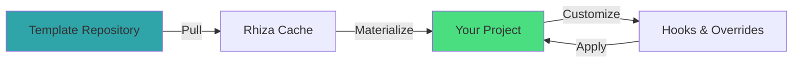

# Your First Sync

Learn how to synchronize Rhiza templates with your project and keep them up to date.

---

## Understanding Template Synchronization

Unlike traditional project generators that create files once and walk away, Rhiza maintains a **living connection** to template repositories. This means:

- :material-sync: Templates can be updated as best practices evolve
- :material-shield-check: Security patches flow automatically
- :material-package-variant: New tooling integrations arrive seamlessly
- :material-cog: You retain full control over what gets synchronized

---

## The Synchronization Process



---

## Step 1: Initialize Your Project

First, create a Rhiza configuration in your project:

```bash
cd /path/to/your/project
uvx rhiza init
```

This creates `.rhiza/template.yml`:

```yaml
# Rhiza template configuration
template:
  repo: https://github.com/jebel-quant/rhiza.git
  ref: main
  paths:
    - .github/
    - Makefile
    - pyproject.toml
    - pytest.ini
    - ruff.toml

variables:
  project_name: my-project
  python_version: "3.11"
```

!!! tip "Configuration Location"
    The `.rhiza/` directory contains all Rhiza-specific files and is typically committed to version control.

---

## Step 2: Review Template Configuration

Edit `.rhiza/template.yml` to customize what gets synchronized:

### Selecting Paths

Choose which template files to sync:

```yaml
template:
  paths:
    # CI/CD workflows
    - .github/workflows/

    # Development tools
    - Makefile
    - .pre-commit-config.yaml

    # Python configuration
    - pyproject.toml
    - pytest.ini
    - ruff.toml

    # Documentation
    - docs/mkdocs.yml
```

### Excluding Files

Exclude specific files or patterns:

```yaml
template:
  exclude:
    - docs/my-custom-page.md
    - .github/workflows/custom-workflow.yml
```

### Setting Variables

Override template variables:

```yaml
variables:
  project_name: my-awesome-project
  project_description: A fantastic Python library
  author_name: Your Name
  author_email: you@example.com
  python_version: "3.12"
  license: MIT
```

---

## Step 3: Preview Changes

Before materializing templates, preview what will change:

```bash
uvx rhiza materialize --dry-run
```

This shows:
- Which files will be created
- Which files will be updated
- Which files will be skipped (because of conflicts)

Example output:
```
Preview Mode - No files will be modified

Files to be created:
  + .github/workflows/ci.yml
  + Makefile
  + pytest.ini

Files to be updated:
  ~ pyproject.toml (will merge)

Files skipped (conflicts):
  ! ruff.toml (local changes detected)

Run without --dry-run to apply changes.
```

!!! warning "Review Carefully"
    Always review the preview before applying changes, especially in existing projects.

---

## Step 4: Materialize Templates

Apply the templates to your project:

```bash
uvx rhiza materialize
```

### Interactive Mode

Rhiza prompts for confirmation when conflicts are detected:

```
Conflict: pyproject.toml has local changes.

Options:
  [k] Keep local version
  [r] Replace with template version
  [m] Merge (manual)
  [d] Show diff
  [a] Abort

Your choice:
```

### Non-Interactive Mode

For automation, use flags:

```bash
# Replace all files without prompting
uvx rhiza materialize --force

# Keep all existing files
uvx rhiza materialize --keep-existing

# Dry run (no changes)
uvx rhiza materialize --dry-run
```

---

## Step 5: Verify the Sync

After materialization, verify everything works:

### Run Tests

```bash
make test
```

### Check Formatting

```bash
make fmt
```

### Review Git Changes

```bash
git status
git diff
```

!!! tip "Commit Changes"
    Commit the synchronized templates to version control:
    ```bash
    git add .
    git commit -m "Sync Rhiza templates"
    ```

---

## Customizing Synchronized Files

You can customize templates without losing the ability to sync.

### Using Hooks

Create pre- or post-materialization hooks:

**`.rhiza/hooks/post_materialize.py`:**
```python
#!/usr/bin/env python3
"""Post-materialization hook to customize files."""

def main():
    # Add custom entries to Makefile
    with open("Makefile", "a") as f:
        f.write("\n# Custom targets\n")
        f.write("custom-target:\n")
        f.write("\t@echo 'Custom command'\n")

if __name__ == "__main__":
    main()
```

Make it executable:
```bash
chmod +x .rhiza/hooks/post_materialize.py
```

### Using Overrides

Create override files that take precedence:

**`.rhiza/overrides/pyproject.toml`:**
```toml
# Custom project configuration
[tool.mypy]
strict = true
```

These are merged with template files during materialization.

---

## Staying Up to Date

### Checking for Updates

See if newer template versions are available:

```bash
uvx rhiza status
```

Output:
```
Template Status:
  Repository: https://github.com/jebel-quant/rhiza.git
  Current Ref: main (abc123)
  Latest Ref: main (def456)
  
Status: Updates available

Files with updates:
  - .github/workflows/ci.yml
  - Makefile
```

### Updating Templates

Pull the latest templates:

```bash
uvx rhiza update
```

This:
1. Fetches latest changes from the template repository
2. Shows a preview of what will change
3. Prompts for confirmation
4. Applies the updates

### Automatic Updates

For automated updates in CI:

```yaml
# .github/workflows/update-templates.yml
name: Update Templates

on:
  schedule:
    - cron: '0 0 * * 1'  # Weekly on Monday

jobs:
  update:
    runs-on: ubuntu-latest
    steps:
      - uses: actions/checkout@v4
      - name: Update Rhiza templates
        run: |
          uvx rhiza update --non-interactive
          git config user.name "GitHub Actions"
          git config user.email "actions@github.com"
          git commit -am "chore: update Rhiza templates" || exit 0
          git push
```

---

## Common Scenarios

### Scenario 1: New Project from Scratch

```bash
mkdir my-project && cd my-project
git init
uvx rhiza init
# Edit .rhiza/template.yml
uvx rhiza materialize
make install
make test
```

### Scenario 2: Adding Rhiza to Existing Project

```bash
cd existing-project
uvx rhiza init
# Review and edit .rhiza/template.yml
uvx rhiza materialize --dry-run
# Review changes carefully
uvx rhiza materialize --keep-existing
# Manually merge any conflicts
```

### Scenario 3: Syncing After Template Updates

```bash
cd my-project
uvx rhiza status
uvx rhiza update
# Review changes
git diff
git commit -am "chore: sync Rhiza templates"
```

### Scenario 4: Custom Template Repository

```yaml
# .rhiza/template.yml
template:
  repo: https://github.com/your-org/custom-templates.git
  ref: main
  paths:
    - all/
```

```bash
uvx rhiza materialize
```

---

## Troubleshooting

### Conflict: Local changes detected

**Problem:** You've modified a template file locally.

**Solution:** Choose one of:
1. Keep your local version (loses template updates)
2. Replace with template version (loses your changes)
3. Merge manually (keeps both)

```bash
# Show differences
uvx rhiza materialize --dry-run

# Keep local changes
uvx rhiza materialize --keep-existing

# Or merge manually
git diff .rhiza/cache/Makefile Makefile
```

### Templates not updating

**Problem:** `rhiza status` shows no updates but you know there are changes.

**Solution:** Clear the cache:

```bash
uvx rhiza clear-cache
uvx rhiza status
```

### Permission denied

**Problem:** Cannot write to project directory.

**Solution:** Check file permissions:

```bash
ls -la
chmod +w .
```

### Variables not substituted

**Problem:** Template variables like `{{ project_name }}` appear in output.

**Solution:** Ensure variables are defined in `.rhiza/template.yml`:

```yaml
variables:
  project_name: my-project
  # Add all required variables
```

---

## Best Practices

!!! tip "Version Control"
    - Commit `.rhiza/template.yml` to version control
    - Commit synchronized files after review
    - Add `.rhiza/cache/` to `.gitignore`

!!! tip "Regular Updates"
    - Check for template updates monthly
    - Review changes before applying
    - Test after syncing

!!! tip "Customization"
    - Use hooks for project-specific customizations
    - Use overrides for configuration
    - Document custom changes in `README.md`

!!! tip "Team Collaboration"
    - Share `.rhiza/template.yml` with team
    - Document sync process in `CONTRIBUTING.md`
    - Use consistent template ref (tag or commit) for stability

---

## Next Steps

!!! success "You've Mastered Synchronization!"
    You now know how to keep your project templates up to date.

<div class="grid cards" markdown>

- :material-tools: [**Development Workflows**](../WORKFLOWS.md)
    
    Learn daily development tasks

- :material-puzzle: [**Customization**](../CUSTOMIZATION.md)
    
    Deep dive into customization options

- :material-file-document: [**Quick Reference**](../QUICK_REFERENCE.md)
    
    All Rhiza commands

- :material-cog: [**Architecture**](../ARCHITECTURE.md)
    
    Understand how Rhiza works

</div>
