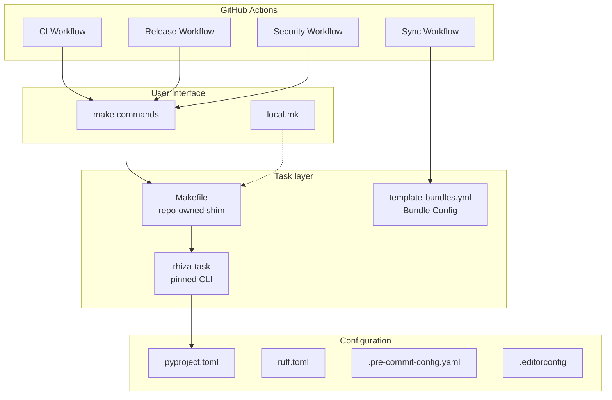
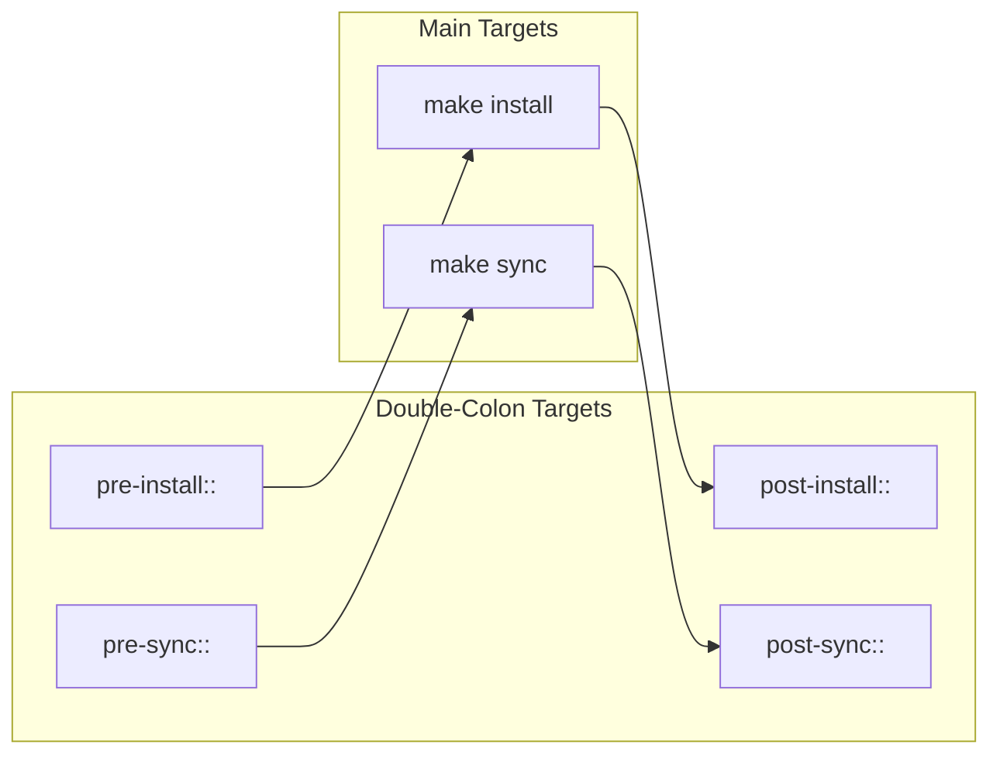
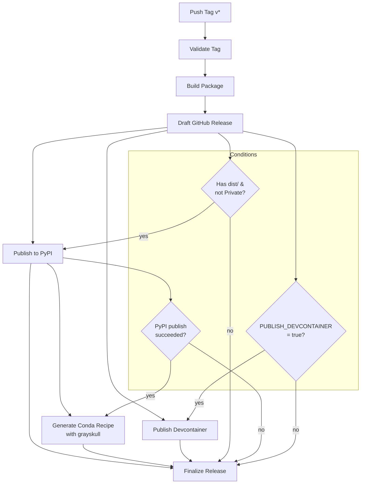
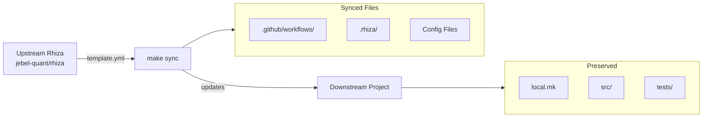
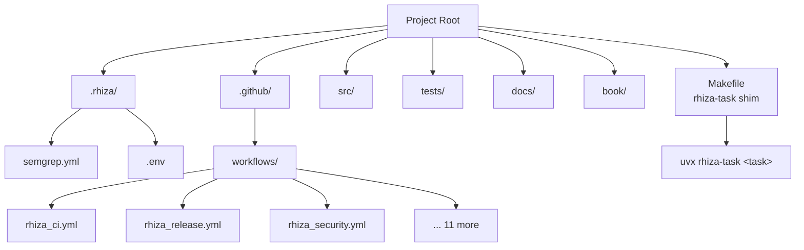
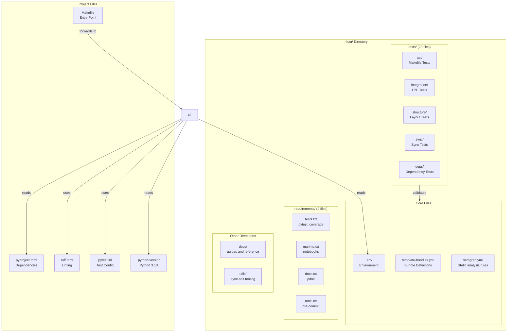
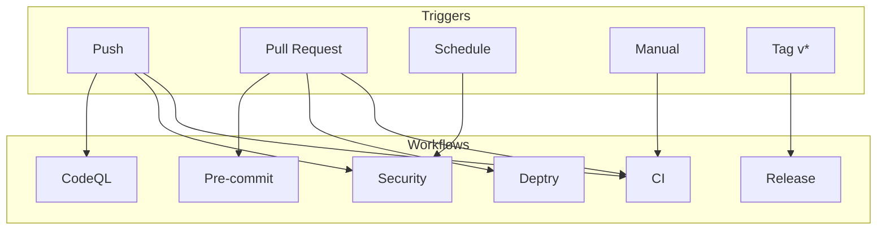
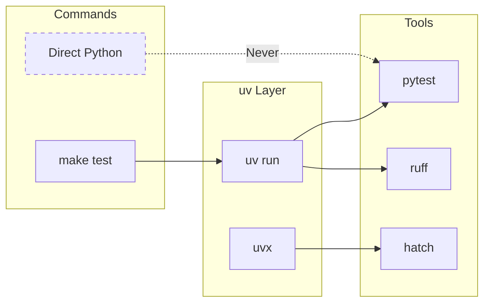

# Rhiza Architecture

Visual diagrams of Rhiza's architecture and component interactions.

## System Overview



## Makefile Hierarchy

```mermaid
flowchart TD
    subgraph Entry["Entry Point"]
        Makefile[Makefile<br/>repo-owned shim]
    end

    subgraph CLI["Pinned CLI"]
        rhizatask[rhiza-task@X.Y.Z<br/>uvx-provisioned]
        registry[task registry<br/>layer:name]
    end

    subgraph Settings["Settings"]
        table["[tool.rhiza-task]<br/>pyproject.toml / rhiza.toml"]
        env[.rhiza/.env<br/>developer-local]
    end

    subgraph Local["Local Customization"]
        localmk[local.mk<br/>Not synced]
        shadow[explicit rules<br/>shadow a task]
    end

    Makefile -->|"%: forwards to"| rhizatask
    Makefile -.->|includes| localmk
    Makefile -.->|beats the catch-all| shadow
    rhizatask --> registry
    registry -->|resolves against| table
    registry -.-> env
```

There is no make layer left to load. `core` ships no `Makefile` and no `.rhiza/rhiza.mk`,
and `.rhiza/make.d/` no longer exists: every fragment it once held retired into
[rhiza-task](https://github.com/Jebel-Quant/rhiza-task), a pinned CLI, in two steps —
eleven at 0.2.0 and the last five at 0.3.0.

A repository generates its front door once:

```bash
uvx rhiza-task shim > Makefile
```

That file is repo-owned from then on. It pins `RHIZA_TASK`, bootstraps uv if the runner has
none, and forwards every unmatched target to the CLI through a `%:` catch-all. What used to
be "which fragments were synced?" is now "which tasks does the pinned version have, for the
language layers this repository has?" — `uvx rhiza-task list` answers it.

| was | is |
| --- | --- |
| `bootstrap.mk` — `install`, uv bootstrap | the `install` task, plus three lines of the shim |
| `test.mk` — test, coverage, typecheck, stress, mutation | the `python`/`rust`/`go` layers and the testing extras |
| `quality.mk` — `fmt`, lint, `rhiza-test` | the neutral quality tasks |
| `book.mk`, `marimo.mk` | the `book` and `marimo` tasks |
| `doctor.mk` | the `doctor` task |
| `releasing.mk` | `/rhiza:release` and bump-my-version |
| `docker.mk`, `github.mk`, `lfs.mk`, `paper.mk`, `presentation.mk` | tasks of the same names, added in rhiza-task 0.3.0 |
| `custom-env.mk`, `custom-task.mk` — example stubs | the repo-owned `Makefile`, or a gitignored `local.mk` |
| `bundles.mk` — mother-repo only | a section of rhiza's own `Makefile` |

Bundles still own capabilities; what a bundle contributes is now configuration and
documentation rather than make recipes. The `docker` bundle ships the `Dockerfile`, `paper`
ships the `docs/paper/` convention, and their targets come from the CLI whatever bundles a
project selected.

## Hook System



## Release Pipeline



## Template Sync Flow



## Directory Structure



## .rhiza/ Directory Structure and Dependencies



## CI/CD Workflow Triggers



## Python Execution Model



## Naming Conventions and Organization Patterns

### Task Naming (rhiza-task)

Task names follow these conventions:

1. **Lowercase with hyphens**: `docs-coverage`, `view-prs`, `marimo-validate` — never
   `docsCoverage` or `Docs_Coverage`.

2. **The same name means the same thing in every language**: `test` is pytest in a Python
   project, `cargo nextest` in a crate and `go test` in a module. That parity is what lets
   the CI workflows call `make typecheck` without knowing the language.

3. **Sections group them**: `Python`, `Rust`, `Go`, `Quality`, `Book`, `Dev`, `Testing extras`
   and one per bundle-owned group (`Docker`, `Git LFS`, `Paper`, `Presentation`,
   `GitHub Helpers`). `uvx rhiza-task list` prints them grouped.

### Target Naming

Make targets follow consistent patterns:

1. **Lowercase with hyphens**: Target names use lowercase with hyphens
   - ✅ `install-uv`, `docker-build`, `view-prs`
   - ❌ `installUv`, `docker_build`, `viewPRs`

2. **Verb-noun pattern**: Action-oriented targets use verb-noun format
   - `install-uv` - Install the uv tool
   - `docker-build` - Build Docker image
   - `view-prs` - View pull requests

3. **Namespace prefixes**: Related targets share a common prefix
   - Docker: `docker-build`, `docker-run`, `docker-clean`
   - LFS: `lfs-install`, `lfs-pull`, `lfs-track`, `lfs-status`
   - GitHub: `gh-install`, `view-prs`, `view-issues`, `failed-workflows`

### Section Headers (`##@`)

Section headers in makefiles group related targets in help output:

1. **Title Case**: Section names use Title Case
   - `##@ Bootstrap`
   - `##@ GitHub Helpers`
   - `##@ Marimo Notebooks`

2. **Descriptive grouping**: Sections group logically related commands
   - **Bootstrap** - Installation and setup
   - **Development and Testing** - Core dev workflow
   - **Documentation** - Doc generation
   - **GitHub Helpers** - GitHub CLI integrations
   - **Quality and Formatting** - Code quality tools

### Hook Naming

Hook targets use double-colon syntax and follow a `pre-`/`post-` pattern:

```makefile
pre-install::    # Runs before make install
post-install::   # Runs after make install
pre-sync::       # Runs before make sync
post-sync::      # Runs after make sync
```

**Key principles**:
- Always use double-colon (`::`) to allow multiple definitions
- Hooks are defined as phony targets
- Empty default implementations use `; @:` syntax

### File Organization Patterns

1. **Directory naming**:
   - Lowercase with hyphens: `template-bundles.yml`, `docs/reference/`
   - Plural for collections: `requirements/`, `templates/`, `tests/`

2. **Test organization** (`tests/`):
   - Tests grouped by **purpose**, not by feature
   - `api/` - Makefile API tests
   - `bundles/` - the bundle contract and per-bundle sync
   - `structure/` - Project structure validation
   - `integration/` - End-to-end workflows
   - `e2e/` - one real toolchain run per language layer
   - `deps/` - Dependency validation

   No bundle ships test code any more. The conformance checks a consumer's repository is
   held to used to be synced into `.rhiza/tests/`; they are the `pytest-rhiza` dependency
   of `make rhiza-test` now (#1540).

3. **Dependency provisioning** (no `.rhiza/requirements/`):
   - Libraries the test suite imports live in `pyproject.toml` `[dependency-groups]`
   - Per-target tooling (pytest plugins, interrogate, mutmut, marimo, zensical, …)
     is installed on the fly by its `make` target via `uv run --with` / `uvx`

### Template Bundle and Profile Naming

`template-bundles.yml` defines two layers: **bundles** (file-owning building blocks) and **profiles** (user-facing presets). See [ADR-0010](../adr/0010-layered-bundle-profile-model.md) for the rationale.

#### Bundles

1. **Lowercase, hyphen-separated**: `core`, `github`, `tests`, `github-tests`
2. **Feature bundles are local-first**: they do not own hosted workflow files
3. **Platform overlays use a `<platform>-` prefix**: `github-tests`, `github-book`, `gitlab`
   - ✅ `github-tests` (GitHub Actions for the `tests` feature)
   - ✅ `github-book` (GitHub Actions for the `book` feature)
   - ❌ embedding workflow files directly in `tests` or `book`

4. **Bundle metadata**:
   - `description` - Clear, concise explanation
   - `standalone` - Whether bundle can be used independently
   - `requires` - Hard dependencies on other bundles
   - `recommends` - Soft dependencies that enhance functionality

#### Profiles

1. **Lowercase, hyphen-separated**: `local`, `github-project`, `gitlab-project`
2. **Intent-focused**: Named after the hosting and automation context, not the tool
   - ✅ `local` (no hosted automation)
   - ✅ `github-project` (standard GitHub project)
   - ❌ `no-workflows`, `full-setup`

3. **Profile metadata**:
   - `description` - Clear summary of the intended context
   - `bundles` - Ordered list of bundles this profile expands to

### Variable Naming

Makefile variables follow these patterns:

1. **SCREAMING_SNAKE_CASE**: All uppercase with underscores
   - `INSTALL_DIR`, `UV_BIN`, `PYTHON_VERSION`, `VENV`

2. **Suffix patterns**:
   - `_BIN` - Executable paths: `UV_BIN`, `UVX_BIN`, `COPILOT_BIN`
   - `_DIR` - Directory paths: `INSTALL_DIR`, `DOCKER_FOLDER`
   - `_VERSION` - Version strings: `PYTHON_VERSION`

3. **Namespace prefixes**: Related variables share prefixes
   - UV tooling: `UV_BIN`, `UVX_BIN`, `UV_LINK_MODE`
   - Color codes: `BLUE`, `GREEN`, `RED`, `YELLOW`, `RESET`, `BOLD`

### Documentation Naming

Documentation files use SCREAMING_SNAKE_CASE:

- `README.md` - Directory/project overview
- `ARCHITECTURE.md` - Architecture diagrams
- `EXTENDING_RHIZA.md` - Customization and extension guide
- `QUICK_REFERENCE.md` - Command reference
- `SECURITY.md` - Security policy

### Workflow Naming (`.github/workflows/`)

GitHub Actions workflows use the pattern `rhiza_<feature>.yml`:

- `rhiza_ci.yml` - Continuous integration
- `rhiza_release.yml` - Release automation
- `rhiza_security.yml` - Security scanning
- `rhiza_deptry.yml` - Dependency checking

**Rationale**: The `rhiza_` prefix clearly identifies template-managed workflows, distinguishing them from user-defined workflows.

## Key Design Principles

### 1. Single Source of Truth

- **Python version**: `.python-version` file (not hardcoded)
- **Dependencies**: `pyproject.toml` (not duplicated in makefiles)
- **Bundle definitions**: `template-bundles.yml` (not scattered)

### 2. Catch-All Delegation

The generated `Makefile` forwards anything it cannot resolve itself:

```makefile
%: $(UVX)
	@$(UVX) $(RHIZA_TASK) $@
```

This allows:
- New tasks to arrive with a version bump, not a file sync
- No include lists, and no ordering to get wrong
- An explicit rule to shadow any task, which is how a project extends one

### 3. Extension Points

Users can extend Rhiza without modifying template files:

1. **Root Makefile**: Add custom targets before `include .rhiza/rhiza.mk`
2. **local.mk**: Local shortcuts (not committed, auto-loaded)
3. **Hooks**: Use double-colon targets (`post-install::`, etc.)

### 4. Fail-Safe Defaults

- Missing tools are detected and installation offered
- Missing directories are created automatically
- Graceful degradation when optional features are unavailable

### 5. Documentation as Code

- Every target has a `##` help comment
- Section headers (`##@`) organize help output
- README files in every major directory
- Comprehensive INDEX.md for quick reference
