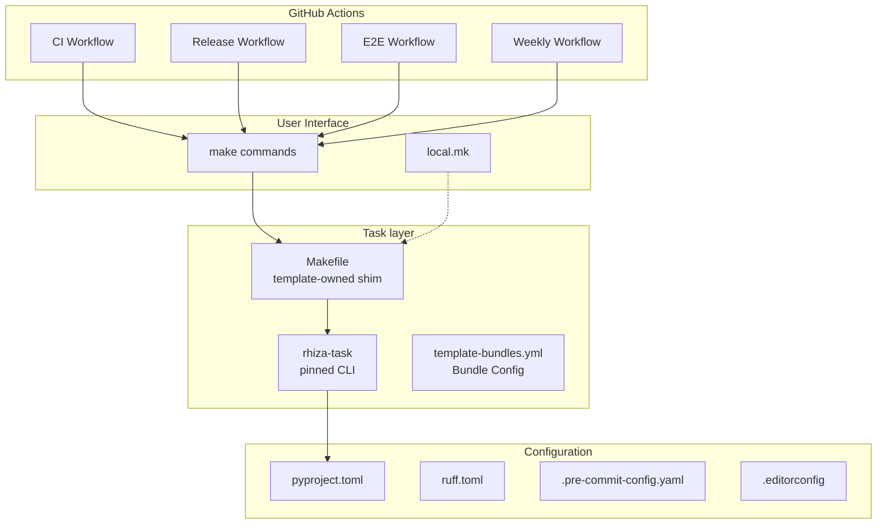
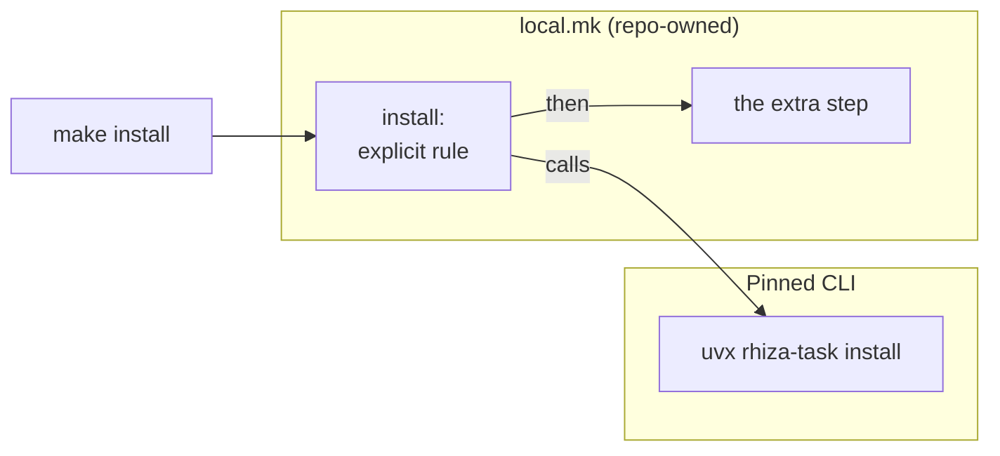
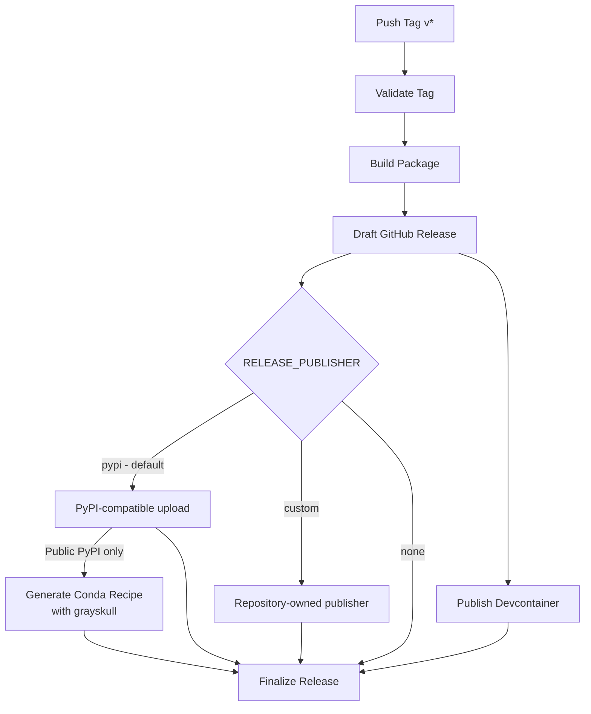
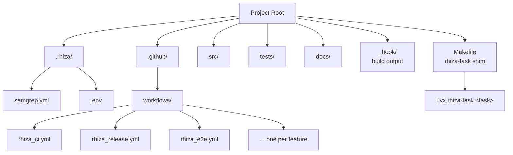
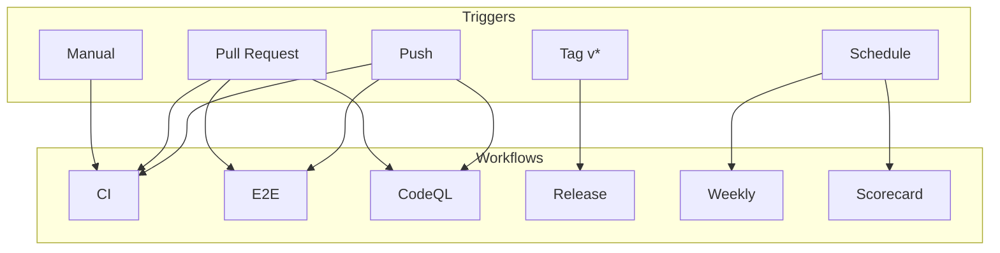
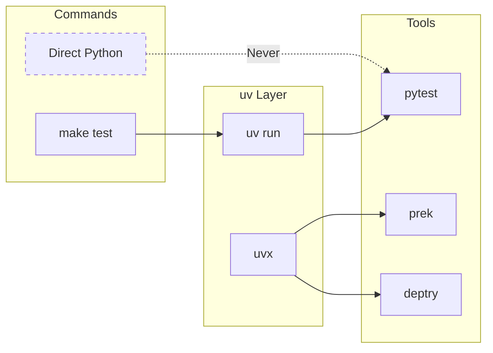

# Rhiza Architecture

Visual diagrams of Rhiza's architecture and component interactions.

## System Overview



## Makefile Hierarchy

```mermaid
flowchart TD
    subgraph Entry["Entry Point"]
        Makefile[Makefile<br/>template-owned shim]
    end

    subgraph CLI["Pinned CLI"]
        rhizatask[rhiza-task@X.Y.Z<br/>uvx-provisioned]
        registry[task registry<br/>layer:name]
    end

    subgraph Settings["Settings"]
        table["[tool.rhiza-task]<br/>pyproject.toml / rhiza.toml"]
        env[.rhiza/.env<br/>developer-local]
    end

    subgraph Local["Local Customization"]
        localmk[local.mk<br/>Repo-owned]
        shadow[explicit rules<br/>shadow a task]
    end

    Makefile -->|"%: forwards to"| rhizatask
    Makefile -.->|includes| localmk
    Makefile -.->|beats the catch-all| shadow
    rhizatask --> registry
    registry -->|resolves against| table
    registry -.-> env
```

There is no make layer left to load. `core` ships no `.rhiza/rhiza.mk` and `.rhiza/make.d/`
no longer exists: every fragment it once held retired into
[rhiza-task](https://github.com/Jebel-Quant/rhiza-task), a pinned CLI, in two steps —
eleven at 0.2.0 and the last five at 0.3.0.

What `core` does still ship is the front door, `Makefile`, at 71 lines instead of 1481. It
pins `RHIZA_TASK`, bootstraps uv if the runner has none, and forwards every unmatched target
to the CLI through a `%:` catch-all. What used to be "which fragments were synced?" is now
"which tasks does the pinned version have, for the language layers this repository has?" —
`uvx rhiza-task list` answers it.

For one release the CLI printed that file itself (`uvx rhiza-task shim > Makefile`) and each
repo owned the copy. That put a template inside the task runner, and the pin inside a
generated file: bumping a repo's gates was a hand edit `/rhiza:update` could not make. The
template owns it again, so `RHIZA_TASK` travels with the sync — the property
`RHIZA_CHECKS_VERSION` already had. Repo-owned targets live in `local.mk`, which the
`Makefile` `-include`s and no sync touches.

| was | is |
| --- | --- |
| `bootstrap.mk` — `install`, uv bootstrap | the `install` task, plus three lines of the shim |
| `test.mk` — test, coverage, typecheck, stress, mutation | the `python`/`rust`/`go` layers and the testing extras — except `mutation`, dropped rather than carried (#1492) |
| `quality.mk` — `fmt`, lint, `rhiza-test` | the neutral quality tasks |
| `book.mk`, `marimo.mk` | the `book` and `marimo` tasks |
| `doctor.mk` | the `doctor` task |
| `releasing.mk` | `/rhiza:release` and bump-my-version |
| `docker.mk`, `github.mk`, `lfs.mk`, `paper.mk`, `presentation.mk` | tasks of the same names, added in rhiza-task 0.3.0 |
| `custom-env.mk`, `custom-task.mk` — example stubs | `local.mk`, which core ships un-ignored so a repo can commit its own targets (#1574) |
| `bundles.mk` — mother-repo only | rhiza's own `local.mk` |

Bundles still own capabilities; what a bundle contributes is now configuration and
documentation rather than make recipes. The `docker` bundle ships the `Dockerfile`, `paper`
ships the `docs/paper/` convention, and their targets come from the CLI whatever bundles a
project selected.

## Extending a Task



An explicit rule beats the shim's `%:` catch-all, so a rule of the same name in `local.mk`
intercepts the invocation and decides what the task is wrapped in. This replaces the
double-colon anchors of the make layer — see [Hook Naming](#hook-naming).

## Release Pipeline



### Choosing a publisher

The GitHub release workflow separates building from publishing: tag validation, package
building, version verification, SBOM and provenance generation remain Rhiza-owned. The
publisher uploads the existing `dist` artifact rather than rebuilding the release.
This extends **destinations and authentication**, not the build system: the standard
package build still produces Python wheels and source distributions.

Set the GitHub Actions repository variable `RELEASE_PUBLISHER`:

| Value | Behaviour |
| --- | --- |
| Unset or `pypi` | Publish through the existing PyPI action. With no feed overrides, use public PyPI Trusted Publishing (OIDC), without stored credentials. |
| `custom` | Invoke the repository-owned action at `.github/actions/release-publish/action.yml` (or `action.yaml`). Never invoke the PyPI publisher as a fallback. |
| `none` | Skip package publication while retaining the other release outputs. |

Unknown values fail the publishing job rather than silently selecting PyPI.
The existing `PYPI_REPOSITORY_URL` **variable** and `PYPI_TOKEN` **secret** remain
supported under `pypi` for compatible upload endpoints. Changing a URL does not make
that publisher support another upload protocol or a provider's login sequence.

`Private :: Do Not Upload` continues to suppress the built-in PyPI publisher,
including its legacy custom-endpoint path. Explicit `custom` selection permits
private distributions; the repository-owned action is responsible for choosing a safe
destination. With the default publisher, a project without a buildable distribution
continues to skip publication. Selecting `custom` without a buildable package, a
publishing action, or actual distribution files is an error. An expected artifact
that fails to download is also an error, not a successful skip.

### Repository-owned publishing action

Commit a composite action at `.github/actions/release-publish/action.yml` in the
consuming repository, then select `RELEASE_PUBLISHER=custom`. The default bundles do
not own this path, so subsequent template updates leave it intact. The optional
`github-codeartifact` bundle is an explicit ownership exception: it manages this
adapter for users choosing its ready-made publisher (see the draft warning below). The
release job checks out the validated release tag: the action must exist in that
revision, not just on the default branch.

The workflow calls the action with these inputs:

| Input | Contract |
| --- | --- |
| `artifacts-dir` | Absolute path to the downloaded `dist` directory containing the verified release artifacts. |
| `tag` | Validated release tag, including its leading `v`. |
| `version` | Tag with the leading `v` removed, not a separately resolved package version. |
| `credentials` | Optional opaque value from the `RELEASE_PUBLISH_CREDENTIALS` secret; its format is owned by the extension. |

The custom-publisher step also provides `RHIZA_RELEASE_PUBLISH_VARS`, a JSON
object containing the Actions `vars` context, because composite action metadata
cannot reference that context directly. This is **non-secret configuration**, not
the `secrets` context; keep credentials in secrets or obtain them through OIDC.

The action owns tool installation, provider configuration, authentication and upload.
It may invoke provider-specific actions, request short-lived credentials through OIDC,
or consume the optional credentials input. For example, a CodeArtifact extension can
assume a publisher role, obtain and immediately mask a short-lived authorization
token, then upload the downloaded distributions. No provider-specific dependencies or
long-lived cloud access keys are required by Rhiza.

The job runs on Ubuntu in the `release` environment with `contents: read` and
`id-token: write`. Configure the provider's trust policy for the appropriate
repository and release environment, and protect release tags and environment access.
Authentication happens **in the publishing job**, not in a prerequisite job.
The extension does not receive all repository secrets: only the explicit credentials
input is forwarded. When invoking the workflow through `workflow_call`, pass that
secret explicitly if needed. Mask generated secrets immediately, keep credentials
out of logs and public outputs, and pin external actions used by the extension.

Upload only the intended distribution files; `artifacts-dir` can also contain
provenance. Do not rebuild or silently ignore authentication/upload failures.
The action must fail when any required upload fails. If it publishes to several
destinations, it must wait for all required uploads before reporting success.

An optional `artifact-url` output may name a **public HTTPS page** for the published
artifact. Rhiza validates it and appends it to the GitHub release notes. It must not
contain credentials, signed access tokens, or private endpoints. Omit it when no safe
public link exists; Rhiza does not infer a custom feed URL or expose credentials in
release notes.

### CodeArtifact publishing bundle (draft — release blocked)

**Do not release or adopt `github-codeartifact` yet.** Safe adoption requires a
change in the separate `rhiza-claude` sync engine first. Its current
`_rhiza_merge.merge_one` copies newly introduced template paths over existing local
files without checking ownership; first sync also copies unconditionally.
Selecting this bundle could therefore overwrite a bespoke publisher before any
bundle-provided check can run.

The release prerequisite is a **pre-write collision check in the sync engine**:
detect existing unmanaged publisher files (including the alternate `action.yaml`
spelling), leave them unchanged, and stop for an explicit ownership migration.
That protection must cover first sync, adding a bundle, and missing-base recovery;
subsequent updates to already managed files must continue to work. A warning or a
test inside this template repository cannot enforce that downstream prerequisite.
This draft intentionally does not claim the safeguard is implemented.

Once that prerequisite is available, adoption will be:

1. Select `github-codeartifact` in the `templates` list of
   `.rhiza/template.yml`. It is not included in any default profile.
2. If a custom publisher already exists, explicitly migrate or retain it before
   transferring ownership. Preserve a copy in git history; do not merely accept
   an automatic overwrite. Projects retaining bespoke publishers should not select
   this bundle.
3. Sync the bundle and commit its managed actions before tagging a release.
4. Configure the following GitHub Actions variables and select the custom publisher:

| Variable | Value |
| --- | --- |
| `RELEASE_PUBLISHER` | `custom` |
| `AWS_REGION` | AWS region containing the CodeArtifact repository |
| `AWS_ROLE_TO_ASSUME_PUBLISH` | IAM role ARN for OIDC publishing |
| `CODEARTIFACT_DOMAIN` | CodeArtifact domain name |
| `CODEARTIFACT_DOMAIN_OWNER` | Twelve-digit AWS account ID owning the domain |
| `CODEARTIFACT_REPOSITORY` | Target CodeArtifact repository name |

The bundle supplies `.github/actions/release-publish/action.yml` as the adapter
and `.github/actions/codeartifact-publish/action.yml` as its implementation.
Both are template-managed after explicit adoption; fixes arrive with ordinary
template updates. No second release workflow is installed. The existing release
job hands over its verified artifacts, and the publisher uploads only wheels and
source distributions, not provenance files. It does not rebuild or fall back to
public PyPI. Missing settings, missing artifacts, failed authentication and failed
uploads are errors and prevent release finalization.

The CodeArtifact publisher requires the workflow event's ref to be the same
release tag as the validated `tag` input. A reusable-workflow call or manual
dispatch from `main` with a separate tag argument is rejected; invoke it in the
tag's context instead. Pull-request events are never accepted.

#### AWS trust and permissions

Create a GitHub OIDC provider and a dedicated publisher role, not long-lived access
keys. For the usual AWS partition, require audience `sts.amazonaws.com` and an
exact subject such as `repo:OWNER/REPOSITORY:environment:release`. **The `release`
environment replaces the tag-ref subject**: an IAM policy restricted only to
`ref:refs/tags/...` will not match this job. If immutable GitHub subjects are
enabled, use the corresponding organization/repository IDs in the subject and
ensure GitHub's setting and IAM's condition agree; do not broaden trust to work
around a mismatch.

Protect the `release` environment with allowed release tags and appropriate
approvals, and restrict who can create those tags or change the actions. Do not
allow untrusted pull requests to assume the publisher role.

The role needs:

- `sts:GetServiceBearerToken`, with `sts:AWSServiceName` restricted to
  `codeartifact.amazonaws.com` (this STS permission uses resource `*`).
- `codeartifact:GetAuthorizationToken` on the selected domain.
- `codeartifact:GetRepositoryEndpoint` on the selected repository.
- `codeartifact:PublishPackageVersion` and `codeartifact:PutPackageMetadata`
  on the intended PyPI package resources.

For cross-account publishing, configure the corresponding domain/repository
resource policies as well. Scope resource ARNs to the required region, account,
domain, repository and packages. Provider partitions may require different OIDC
audiences and endpoints; validate the supported partition before deployment.

Authentication and upload occur in the same job. The action requests a short-lived
CodeArtifact token, masks it immediately, and does not expose it as a job output or
persist it as a repository secret. No `PYPI_TOKEN` or `RELEASE_PUBLISH_CREDENTIALS`
is needed. Private endpoints are not returned as public artifact links.

This bundle covers **publishing only**. It does not authenticate the earlier build
or SBOM job, or any test/documentation job that consumes private dependencies.
Named uv-index authentication with separate reader roles and fork-PR safeguards
remains a separate part of issue #1685. A real AWS OIDC publishing run remains
necessary before release; mocked workflow tests cannot verify an adopter's IAM
trust and resource policies.

### Completion and platform scope

Release finalization waits for the selected publisher and the devcontainer job;
neither may fail and still allow the release to be finalized. Explicit package skips
remain successful, and cancellation never finalizes the release.
Conda recipe generation remains optional and only follows successful **public PyPI**
publication with no `PYPI_REPOSITORY_URL` override. A custom or legacy private-feed
upload must not trigger a lookup on public PyPI. A failed optional Conda recipe does
not prevent finalization.

This extension contract is **GitHub Actions-only**. The GitLab release template retains
its existing token/URL publishing behaviour. It also does not configure private-feed
**consumption** in build, test or documentation jobs: those jobs need their own
authentication before resolving dependencies, because job credentials are not shared.

## Template Sync Flow

```mermaid
flowchart LR
    upstream[Upstream Rhiza<br/>jebel-quant/rhiza] -->|template.yml| sync[/rhiza:update]
    sync -->|updates| downstream[Downstream Project]

    subgraph Synced["Synced Files"]
        workflows[.github/workflows/]
        rhiza[.rhiza/]
        configs[Config Files]
    end

    subgraph Preserved["Preserved"]
        localmk[local.mk]
        src[src/]
        tests[tests/]
    end

    sync --> Synced
    downstream --> Preserved
```

## Directory Structure



## .rhiza/ Directory Structure and Dependencies

```mermaid
flowchart TB
    subgraph rhiza[".rhiza/ (template-owned)"]
        direction TB
        pointer[template.yml<br/>which bundles to sync]
        lock[template.lock<br/>what was synced]
        semgrep[semgrep.yml<br/>static analysis rules]
        env[".env (optional, gitignored)<br/>developer-local settings"]
    end

    subgraph project["Project Files (repo-owned)"]
        direction TB
        Makefile[Makefile<br/>template-owned shim]
        localmk[local.mk<br/>own targets]
        pyproject["pyproject.toml<br/>[tool.rhiza-task] settings"]
        ruff_toml[ruff.toml<br/>linting]
        pytest_ini[pytest.ini<br/>test config]
        python_version[.python-version<br/>the Python to fetch]
    end

    cli[uvx rhiza-task]

    Makefile -->|forwards to| cli
    localmk -.->|shadows a task| cli
    cli -->|reads| pyproject
    cli -.->|reads| env
    cli -->|reads| python_version
    cli -->|uses| pytest_ini
    cli -->|uses| ruff_toml
    pointer -->|drives| sync[/rhiza:update]
    sync -->|records| lock
```

Two directories that earlier versions of this diagram showed are gone, and both went for the
same reason — code and dependency lists distributed by file-copy became dependencies:

- **`.rhiza/requirements/`** — retired: four `.txt` files that pinned per-target tooling.
  Every tool is provisioned where it is used now (`uv run --with`, `uvx`), so a target's
  tooling travels with the target (#1380).
- **`.rhiza/tests/`** — retired: the conformance checks a consumer's repository is held to,
  formerly synced as seven modules plus a `conftest.py`. They are the `pytest-rhiza` dependency of
  `make rhiza-test` now, pinned by `[tool.rhiza-task]`'s `pytest-rhiza` (#1540). A repo that
  synced before that keeps the folder on disk, inert — the gate names modules, not paths.

## CI/CD Workflow Triggers



Every gate a pull request must pass is a **job** of `rhiza_ci.yml` — the pre-commit hooks,
`deptry`, `docs-coverage`, the security scan, the licence scan — not a workflow of its own.
That is what the required status checks in `.github/rulesets/main-branch-protection.json`
name, and why renaming a job breaks branch protection.

## Python Execution Model



## Naming Conventions and Organization Patterns

### Task Naming (rhiza-task)

Task names follow these conventions:

1. **Lowercase with hyphens**: `docs-coverage`, `view-prs`, `marimo-validate` — never
   `docsCoverage` or `Docs_Coverage`.

2. **The same name means the same thing in every language**: `test` is pytest in a Python
   project, `cargo nextest` in a crate and `go test` in a module. That parity is what lets
   the CI workflows call `make typecheck` without knowing the language.

3. **Sections group them**: `Python`, `Rust`, `Go`, `Quality`, `Book`, `Dev`, `Testing extras`
   and one per bundle-owned group (`Docker`, `Git LFS`, `Paper`, `Presentation`,
   `GitHub Helpers`). `uvx rhiza-task list` prints them grouped.

### Target Naming

Make targets follow consistent patterns:

1. **Lowercase with hyphens**: Target names use lowercase with hyphens
   - ✅ `install-uv`, `docker-build`, `view-prs`
   - ❌ `installUv`, `docker_build`, `viewPRs`

2. **Verb-noun pattern**: Action-oriented targets use verb-noun format
   - `install-uv` - Install the uv tool
   - `docker-build` - Build Docker image
   - `view-prs` - View pull requests

3. **Namespace prefixes**: Related targets share a common prefix
   - Docker: `docker-build`, `docker-run`, `docker-clean`
   - LFS: `lfs-install`, `lfs-pull`, `lfs-track`, `lfs-status`
   - GitHub: `view-prs`, `view-issues`, `failed-workflows`, `workflow-status`

### Help Text

`make help` is the shim's one non-delegating rule, and it prints two lists:

1. **The CLI's tasks**, grouped by the section each declares, from `uvx rhiza-task list`.
   Nothing in the repository states those groups — see [Task Naming](#task-naming-rhiza-task).

2. **Repo-owned targets**, scraped from a `##` comment on the rule itself:

   ```makefile
   e2e: install $(UV) ## run the language-layer end-to-end suite against real toolchains
   ```

   The shim greps `$(MAKEFILE_LIST)`, so this is what lets a repo move its targets into
   `local.mk` without losing them from `make help`. The `##@` section headers of the make
   layer are gone with the layer that parsed them.

### Hook Naming

**Retired with the make layer.** `bootstrap.mk` anchored `pre-install::`/`post-install::`
and their `sync` counterparts as double-colon no-ops so a consumer could chain onto them,
and that was the documented way to add project hooks. `uvx rhiza-task install` knows nothing
about make targets, so there is nothing to chain onto.

Shadow the target instead: an explicit `install:` rule in `local.mk` beats the shim's `%:`
catch-all, so it can call the CLI and then the extra step.

### File Organization Patterns

1. **Directory naming**:
   - Lowercase with hyphens: `template-bundles.yml`, `docs/reference/`
   - Plural for collections: `requirements/`, `templates/`, `tests/`

2. **Test organization** (`tests/`):
   - Tests grouped by **purpose**, not by feature
   - `api/` - Makefile API tests
   - `bundles/` - the bundle contract and per-bundle sync
   - `structure/` - Project structure validation
   - `integration/` - End-to-end workflows
   - `e2e/` - one real toolchain run per language layer
   - `deps/` - Dependency validation

   No bundle ships test code any more. The conformance checks a consumer's repository is
   held to used to be synced into `.rhiza/tests/`; they are the `pytest-rhiza` dependency
   of `make rhiza-test` now (#1540).

3. **Dependency provisioning** (the `.rhiza/requirements/` lists are gone):
   - Libraries the test suite imports live in `pyproject.toml` `[dependency-groups]`
   - Per-target tooling (pytest plugins, interrogate, marimo, zensical, …)
     is installed on the fly by its `make` target via `uv run --with` / `uvx`

### Template Bundle and Profile Naming

`template-bundles.yml` defines two layers: **bundles** (file-owning building blocks) and **profiles** (user-facing presets). See [ADR-0010](../adr/0010-layered-bundle-profile-model.md) for the rationale.

#### Bundles

1. **Lowercase, hyphen-separated**: `core`, `github`, `tests`, `github-tests`
2. **Feature bundles are local-first**: they do not own hosted workflow files
3. **Platform overlays use a `<platform>-` prefix**: `github-tests`, `github-book`, `gitlab`
   - ✅ `github-tests` (GitHub Actions for the `tests` feature)
   - ✅ `github-book` (GitHub Actions for the `book` feature)
   - ❌ embedding workflow files directly in `tests` or `book`

4. **Bundle metadata**:
   - `description` - Clear, concise explanation
   - `standalone` - Whether bundle can be used independently
   - `requires` - Hard dependencies on other bundles
   - `recommends` - Soft dependencies that enhance functionality

#### Profiles

1. **Lowercase, hyphen-separated**: `local`, `github-project`, `gitlab-project`
2. **Intent-focused**: Named after the hosting and automation context, not the tool
   - ✅ `local` (no hosted automation)
   - ✅ `github-project` (standard GitHub project)
   - ❌ `no-workflows`, `full-setup`

3. **Profile metadata**:
   - `description` - Clear summary of the intended context
   - `bundles` - Ordered list of bundles this profile expands to

### Setting Naming

The make layer's forty-odd `SCREAMING_SNAKE_CASE` variables — the `_BIN` paths, the
`_FOLDER` accumulators, the colour codes — are settings of the pinned CLI now, and the
naming follows the surface they are written on:

1. **`kebab-case` in TOML**: `source-folder`, `pytest-rhiza`, `mkdocs-extra-packages` in
   `[tool.rhiza-task]` (`pyproject.toml`, or `rhiza.toml` for a project with no Python
   manifest).

2. **`RHIZA_`-prefixed `SCREAMING_SNAKE_CASE` in the environment**: the same setting, upper
   cased and prefixed — `RHIZA_SOURCE_FOLDER`, `RHIZA_CI_OS_MATRIX`. This is the surface a
   CI job or a `local.mk` `export` uses.

3. **Resolution order**: defaults → `.rhiza/.env` → the TOML table → `RHIZA_*` → CLI flags.

Three make variables survive, all in the shim and all about reaching the CLI at all:
`RHIZA_TASK` (the pin), `INSTALL_DIR` and `UVX`/`UV`.

### Documentation Naming

Documentation files use SCREAMING_SNAKE_CASE:

- `README.md` - Directory/project overview
- `ARCHITECTURE.md` - Architecture diagrams
- `EXTENDING_RHIZA.md` - Customization and extension guide
- `QUICK_REFERENCE.md` - Command reference
- `SECURITY.md` - Security policy

### Workflow Naming (`.github/workflows/`)

GitHub Actions workflows use the pattern `rhiza_<feature>.yml`:

- `rhiza_ci.yml` - Continuous integration
- `rhiza_release.yml` - Release automation
- `rhiza_e2e.yml` - One real toolchain run per language layer
- `rhiza_codeql.yml` - CodeQL analysis

**Rationale**: The `rhiza_` prefix clearly identifies template-managed workflows, distinguishing them from user-defined workflows.

## Key Design Principles

### 1. Single Source of Truth

- **Python version**: `.python-version` file (not hardcoded)
- **Dependencies**: `pyproject.toml` (not duplicated in makefiles)
- **Bundle definitions**: `template-bundles.yml` (not scattered)

### 2. Catch-All Delegation

The `Makefile` forwards anything it cannot resolve itself:

```makefile
%: $(UVX) FORCE
	@$(UVX) $(RHIZA_TASK) $(RHIZA_TASK_GOAL)
```

`FORCE` is what keeps every task phony — `.PHONY` takes no patterns, but a phony
prerequisite is never up to date, so `make book` still runs next to a `book/` directory.

This allows:
- New tasks to arrive with a version bump, not a file sync
- No include lists, and no ordering to get wrong
- An explicit rule to shadow any task, which is how a project extends one

### 3. Extension Points

Users can extend Rhiza without modifying template files — and the `Makefile` is now one of
the files they must not modify, since `core` ships it and every sync overwrites it:

1. **`local.mk`**: own targets, and wrapping a task by shadowing its name. The `Makefile`
   `-include`s it and `core` leaves it un-ignored, so it is committed like any source file.
   Shadowing reaches a task make resolves — not one the CLI reaches internally, and not CI,
   which never runs make.
2. **`local-setup.sh`**: a native binary the project needs before any gate. Every layer's
   `install` runs it, which is what puts it on the path of local make, both CI platforms and
   the devcontainer at once. Committed, un-ignored by `core` for the same reason `local.mk` is.
3. **`[tool.rhiza-task]`**: settings, in `pyproject.toml` or `rhiza.toml`.
4. **`RHIZA_*` in the environment**: the same settings for a CI job, or for a `local.mk`
   `export` when the value must be committed.
5. **`exclude:` in `.rhiza/template.yml`**: opting a managed file out of the sync entirely.

The full account, with the failure mode of each, is the
[Customization Guide](../guides/CUSTOMIZATION.md).

### 4. Fail-Safe Defaults

- Missing `uv` is installed by the shim, into `./bin`, before any task runs
- A layer's toolchain absence skips the e2e suite with a reason rather than failing it
- Graceful degradation when optional features are unavailable

The one place that principle is deliberately *not* applied: a path-scoped gate skips a
`source_folder` that does not exist, so it reports success having measured nothing. That is
why a repository whose source root is not `src/` must declare it — see #1505, #1511, #1516,
and the `source-folder` line in this repository's own `pyproject.toml`.

### 5. Documentation as Code

- Every repo-owned target carries a `##` help comment, enforced by a pre-commit hook
- Every architectural decision has an [ADR](../adr/index.md)
- README files in every major directory
- Docs are gated: links resolve, bundles are documented, and every `make` target a document
  names must exist (`tests/docs/test_doc_consistency.py`)
