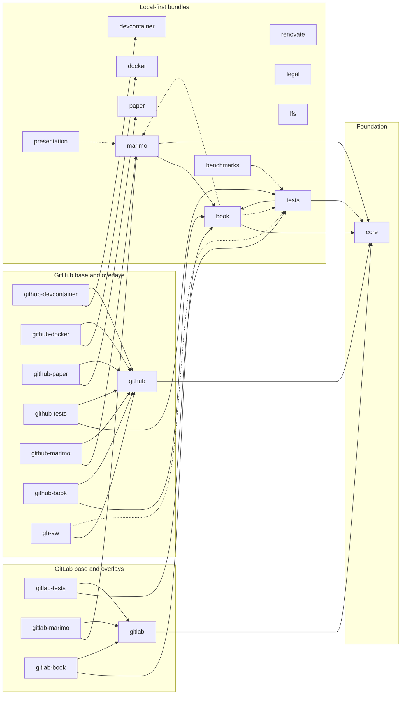

# Rhiza Glossary

A comprehensive glossary of terms used in the Rhiza template system.

## Core Concepts

### rhiza (template repository)
The GitHub repository (`jebel-quant/rhiza`) that contains the curated set of configuration files, Makefile modules, CI/CD workflows, and other tooling files that downstream projects sync from. This is the *content* — the files you receive. See also: [rhiza-cli](#rhiza-cli).

### rhiza-cli
A standalone Python package (published on PyPI as `rhiza-cli`) that provides the `rhiza` command-line interface. It is the *engine* that reads `.rhiza/template.yml` and performs operations such as `init`, `sync`, `bump`, and `release`. Invoked via `uvx rhiza ...` without requiring a permanent installation. Versioned independently from the template repository. See also: [rhiza (template repository)](#rhiza-template-repository).

### Living Templates
A template approach where configuration files remain synchronized with an upstream source over time, as opposed to traditional "one-shot" template generators (like cookiecutter or copier) that generate files once and then disconnect from the source.

### Template Sync
The process of pulling updates from the upstream Rhiza repository into a downstream project. Executed via `make sync`. Allows projects to receive ongoing improvements without manual copying.

### Downstream Project
A project that has adopted Rhiza templates. It receives updates from the upstream Rhiza repository through template sync.

### Upstream Repository
The source Rhiza repository (`jebel-quant/rhiza`) that contains the canonical template configurations. Changes here propagate to downstream projects via sync.

## Bundle Model

### Bundle
The atomic unit of Rhiza adoption. A bundle owns a coherent set of synced files and may declare hard dependencies via `requires` and optional relationships via `recommends`.

### Profile
A named preset in `.rhiza/template-bundles.yml` that expands to a curated set of bundles for a common use case such as `local`, `github-project`, or `gitlab-project`.

### Overlay Bundle
A platform-specific bundle such as `github-tests` or `gitlab-book` that layers hosted CI/CD files on top of a feature bundle. Overlay bundles depend on both the feature they extend and the platform base bundle.

### Stub Workflow
A thin injected workflow file that delegates to a reusable workflow in `jebel-quant/rhiza`. These stubs live in overlay bundles rather than in local-first feature bundles.

### Bundle Dependency Map
Solid arrows show `requires` dependencies; dotted arrows show `recommends` relationships.

## Directory Structure

### `.rhiza/`
The core directory containing Rhiza's template system files. This directory is synced from upstream and should generally not be modified directly.

### `.rhiza/rhiza.mk`
The main Makefile containing core Rhiza functionality. Included by the project's root `Makefile`. Contains 268+ lines of make targets and logic.

### `.rhiza/make.d/`
Directory for modular Makefile extensions. Files are auto-loaded in numeric order:
- `00-19`: Configuration files
- `20-79`: Task definitions
- `80-99`: Hook implementations

### `.rhiza/utils/`
Python utility scripts for Rhiza operations.

### `.rhiza/template.yml`
Configuration file defining which files to sync from upstream, include/exclude patterns, and sync behavior.

### `local.mk`
Optional file for project-specific Makefile extensions. Not synced from upstream, allowing local customization without conflicts.

## Makefile System

### Double-Colon Targets (`::`)
Make targets defined with `::` instead of `:`. These are "hook" targets that can be extended by downstream projects without overriding the original implementation.

### Hook Targets
Extension points in the Makefile system. Available hooks:
- `pre-install::` / `post-install::` - Before/after dependency installation
- `pre-sync::` / `post-sync::` - Before/after template sync
- `pre-validate::` / `post-validate::` - Before/after project validation
- `pre-release::` / `post-release::` - Before/after release creation
- `pre-bump::` / `post-bump::` - Before/after version bump

### Make Target
A named command in the Makefile (e.g., `make test`, `make fmt`). Rhiza provides 40+ targets out of the box.

## Version Management

### Version Bump
Incrementing the version number in `pyproject.toml`. Types:
- `major`: Breaking changes (1.0.0 → 2.0.0)
- `minor`: New features (1.0.0 → 1.1.0)
- `patch`: Bug fixes (1.0.0 → 1.0.1)

### Release Tag
A git tag prefixed with `v` (e.g., `v1.2.3`) that triggers the release workflow.

### Version Matrix
A JSON array of Python versions to test against, generated from `pyproject.toml`'s `requires-python` field. Used in CI for matrix testing.

## CI/CD

### OIDC Publishing
OpenID Connect-based authentication for PyPI publishing. Uses GitHub's identity provider instead of stored API tokens. More secure than traditional token-based auth.

### Trusted Publisher
A PyPI configuration that allows a specific GitHub repository/workflow to publish packages without API tokens, using OIDC authentication.

### Matrix Testing
Running CI tests across multiple Python versions simultaneously. Rhiza supports Python 3.11, 3.12, 3.13, and 3.14.

### SLSA Provenance
Supply-chain Levels for Software Artifacts. Cryptographic attestations proving that build artifacts were produced by a specific CI workflow. Enables supply chain verification.

### SBOM (Software Bill of Materials)
A formal record of components used to build software. Generated in SPDX or CycloneDX formats for supply chain transparency.

## Tools

### uv
A fast Python package installer and resolver from Astral. Rhiza uses `uv` for all Python operations:
- `uv sync` - Install dependencies
- `uv run` - Execute Python code
- `uvx` - Run external tools

### Ruff
A fast Python linter and formatter from Astral. Replaces flake8, isort, black, and many other tools. Configured in `ruff.toml`.

### Hatch
A Python build backend used to create distribution packages (wheels and sdists). Invoked via `uv build`.

### Deptry
A tool that checks for unused and missing dependencies in Python projects. Integrated in CI via `make deptry`.

### Bandit
A security linter for Python code. Finds common security issues. Integrated in pre-commit and CI.

### CodeQL
GitHub's semantic code analysis engine. Scans for security vulnerabilities in Python code and GitHub Actions workflows.

### Marimo
A reactive Python notebook format. Rhiza includes support for marimo notebooks in the `book/` directory.

## Configuration Files

### `pyproject.toml`
The central Python project configuration file (PEP 518/621). Contains project metadata, dependencies, and tool configurations.
Rhiza's core template ships a starter `pyproject.toml` and validates a minimum structure:
`[project]` with `name`, `version`, `description`, `readme`, `requires-python`, plus `[dependency-groups]`.

### `uv.lock`
Lock file containing exact versions of all dependencies. Ensures reproducible builds across environments.

### `.python-version`
Single-line file specifying the default Python version for the project. Used by `uv` and other tools.

### `ruff.toml`
Configuration for the Ruff linter/formatter. Defines enabled rules, line length, and per-file exceptions.

### `pytest.ini`
Configuration for pytest test runner. Sets logging levels and output options.

### `.pre-commit-config.yaml`
Configuration for pre-commit hooks. Defines checks that run before each git commit.

### `.editorconfig`
Cross-editor configuration for consistent coding style (indentation, line endings, etc.).

### `renovate.json`
Configuration for Renovate, an automated dependency update bot.

## Workflows

### CI Workflow
Continuous Integration workflow that runs tests on every push and pull request.

### Release Workflow
Multi-phase workflow triggered by version tags. Builds packages, creates GitHub releases, publishes to PyPI, and optionally publishes devcontainer images.

### Sync Workflow
Workflow that synchronizes template files from upstream Rhiza repository.

### Security Workflow
Workflow running security scans (pip-audit, bandit) on the codebase.

## Commands Reference

| Command | Description |
|---------|-------------|
| `make install` | Install dependencies and set up environment |
| `make test` | Run pytest with coverage |
| `make fmt` | Format and lint code with ruff |
| `make sync` | Sync templates from upstream |
| `make bump` | Bump version number |
| `make release` | Create and push release tag |
| `make publish` | Bump version, create tag and push in one step |
| `make release-status` | Show release workflow status and latest release |
| `make deptry` | Check for unused/missing dependencies |
| `make help` | Show all available targets |
